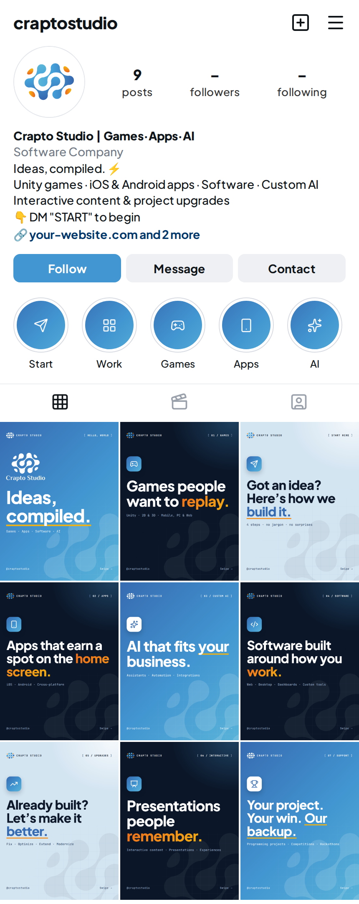

# Crapto Studio: brand & Instagram kit

Everything needed to launch the **@craptostudio** Instagram account: brand rules, profile copy, a content plan, and upload-ready images built from the Crapto Studio logo.

> **Ideas, compiled.** Games · Apps · Software · AI



## Start here

| Step | Read | Upload |
|---|---|---|
| 1. Set up the profile | [instagram/01-profile-setup.md](instagram/01-profile-setup.md) | `exports/profile/profile-picture.png`, `exports/highlights/*.png` |
| 2. Publish the 9 launch posts | [instagram/03-launch-posts.md](instagram/03-launch-posts.md) | `exports/posts/01-support/` → `exports/posts/09-intro/` (in that order) |
| 3. Keep posting | [instagram/02-content-strategy.md](instagram/02-content-strategy.md), [instagram/04-idea-bank.md](instagram/04-idea-bank.md) | |
| Brand rules (colours, fonts, logo use, voice) | [brand/brand-guide.md](brand/brand-guide.md) | `exports/brand/brand-board.png` to share with designers |

## What's in the repo

```
brand/
  brand-guide.md            brand rules: positioning, voice, logo, colour, type
  logo/source/              the original logo files (untouched)
instagram/
  01-profile-setup.md       username, name, bio, highlights, DM replies, checklist
  02-content-strategy.md    pillars, formats, weekly rhythm, hashtags, metrics, first 30 days
  03-launch-posts.md        the 9 launch posts with captions, hashtags and alt text
  04-idea-bank.md           48+ post ideas, reel scripts, story formats, hook formulas
exports/                    upload-ready images (generated, see below)
  profile/                  profile picture (white and dark versions), 1080×1080
  highlights/               10 story highlight covers, 1080×1920
  posts/NN-<name>/          launch carousels, 1080×1350; 01.png is the cover
  logo/                     trimmed logo, symbol and wordmark PNGs (colour/white/black)
  preview/                  profile mockup and grid preview
  brand/brand-board.png     one-page brand overview
design/                     the template system that generates exports/
```


## Editing and regenerating the images

All images are generated from code, so text changes don't need a design tool.

- **Change post text:** edit `design/content.mjs`. Wrap a word in `*asterisks*` to highlight it.
- **Change colours or fonts:** edit `design/tokens.mjs`.
- **Change layouts:** edit `design/templates.mjs`.

Then rebuild:

```bash
npm install
npx playwright install chromium   # first time only
npm run build                     # logo crops + every image in exports/
```

`npm run logo` re-cuts the logo PNGs from `brand/logo/source/`, and `npm run render` re-renders the posts, highlights, profile pictures and previews.

To add a new carousel, add an entry to `posts` in `design/content.mjs`. Slide types are `list`, `steps`, `statement`, `services` and `cta`.

## Credits

- Fonts: [Plus Jakarta Sans](https://fonts.google.com/specimen/Plus+Jakarta+Sans) and [JetBrains Mono](https://fonts.google.com/specimen/JetBrains+Mono), both SIL Open Font License.
- Icons: [Lucide](https://lucide.dev), ISC License.
