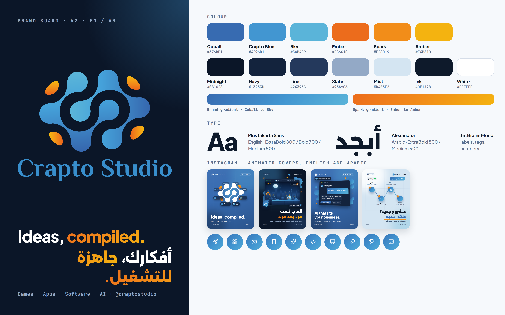

# Crapto Studio: Brand Guide

How Crapto Studio looks, sounds and shows up, on Instagram and everywhere else.
Use this guide when you write a caption, design a post, reply to a DM, or send the logo to someone.

> **Handle:** this guide assumes the Instagram handle is **@craptostudio**. If yours is different, change it here, in the [`../instagram/`](../instagram/) docs and in [`../design/tokens.mjs`](../design/tokens.mjs) (then rebuild the images, see [section 9](#9-instagram-template-system)).



## Quick reference

| Item | Rule |
|---|---|
| Name | **Crapto Studio** (always in full) |
| Handle | @craptostudio |
| What we are | A tech solutions studio |
| Tagline | **Ideas, compiled.** |
| Primary colour | Crapto Blue `#4296D1`, used as the blue gradient Cobalt → Sky |
| Accent | Spark `#F28D19`, small amounts only |
| Fonts | Plus Jakarta Sans (headlines and body), JetBrains Mono (labels and numbers) |
| Icons | Lucide line icons |
| Main logo file | [`logo/source/Crapto Studio-08.png`](logo/source/Crapto%20Studio-08.png) |
| DM keyword | **START** |

## Contents

1. [Who we are](#1-who-we-are)
2. [Who we serve](#2-who-we-serve)
3. [Personality, voice and tone](#3-personality-voice-and-tone)
4. [Name usage](#4-name-usage)
5. [Logo](#5-logo)
6. [Colour](#6-colour)
7. [Typography](#7-typography)
8. [Graphic style](#8-graphic-style)
9. [Instagram template system](#9-instagram-template-system)

---

## 1. Who we are

**Positioning**

Crapto Studio is a tech solutions studio. We design and build games in Unity, iOS and Android apps, software and custom AI. We also create interactive content and presentations, and we improve projects that already exist: fixing them, speeding them up and adding new features. For students and competition teams, we offer mentoring and guidance. We keep things practical: honest scoping, a clear plan, progress you can see every week, and support after launch.

**Elevator pitch (one line)**

> Crapto Studio designs and builds games, apps, software and custom AI, and levels up projects that already exist.

**Tagline**

> **Ideas, compiled.**

What it means:

- In programming, *compiling* turns source code into a program that actually runs.
- You bring the idea (the "source"). We turn it into something real that works: a game, an app, a tool, an AI feature.
- It is short, a little nerdy, and it says "we build things" without any buzzwords.

How to write it: always **"Ideas, compiled."**, with a capital I, a comma, a lowercase c and a full stop. Do not translate it, change it ("Ideas compiled!", "Your ideas, compiled") or add to it.

Where to use it: the first slide of the intro post, the bio (if the version you pick includes it), the end of a presentation, email signatures, and under the logo on large layouts. Do not use it more than once per post.

---

## 2. Who we serve

| # | Audience | What they need | Services that fit | What to show them |
|---|---|---|---|---|
| 1 | **Startups and small businesses** | An app, software or AI built properly, a clear price and timeline, someone who explains things simply | App development (iOS / Android), software development, custom AI solutions, custom solutions | Process posts, "how we work", honest advice ("you may not need AI for this") |
| 2 | **Brands, marketers, educators and event teams** | Content that people remember: interactive presentations, kiosks, lessons, quizzes, gamified campaigns | Interactive content and presentations, games in Unity (advergames), custom solutions | Short videos of interactive pieces in use, before/after of a dull deck |
| 3 | **Founders, creators and brands who want a game** | A playable game or prototype in Unity, from idea to release | Games development in Unity Engine, interactive content | Gameplay clips, prototypes, behind-the-scenes in the Unity editor |
| 4 | **Students and competition / hackathon teams** | Mentoring and guidance: someone to review their code, help them debug and explain the "why". Not someone to do the work for them | Support for programming projects and competitions | Tips, "how to prepare for a hackathon", short explainers |
| 5 | **Owners of existing apps, games or software** | Fixes, better speed, new features, updates to new versions, without starting over | Improving or enhancing existing projects, plus app, software and game development | Before/after: load times, UI refresh, bug-fix stories (with permission) |

---

## 3. Personality, voice and tone

### 3.1 Personality: four traits

| Trait | What it means | Sounds like | Never sounds like |
|---|---|---|---|
| **Builder** | Practical. We ship real things. | "Here's what we build and how." | Big promises with no details |
| **Playful-smart** | Game-dev DNA, a bit of wit, never silly | "Games people want to replay." | Memes, slang overload, jokes at the client's expense |
| **Straight-talking** | Honest scoping, no jargon. We say when you don't need something. | "Honest answer: you may not need AI for this." | "Our AI-powered solution fits every business!" |
| **Reliable** | Clear process, weekly progress, we stick around after launch | "You see a working build every week." | "We'll get back to you… sometime." |

### 3.2 Voice: do and don't

| Do | Don't |
|---|---|
| Use short sentences and everyday words | Write long paragraphs or walls of text |
| Say what we build, for whom, and what happens next | Stay vague ("we offer solutions") |
| Explain a technical word, or leave it out | Use jargon to sound smart |
| Be honest about scope, time and what's needed | Promise prices, deadlines or results we haven't checked |
| Write "we" and "you" | Write "the company" or "our esteemed clients" |
| Add one light, clever line when it fits | Force jokes, or use humour in serious replies (complaints, bugs) |
| End with one clear next step (DM "START", link in bio) | End with three different calls to action |
| Use 0 to 3 emoji per caption, only where they help | Use emoji chains (🔥🔥🔥) or crypto-style emoji (🚀🌕💎📈🪙💰⚡) |

### 3.3 Words we use / words we avoid

| Words we use | Words we avoid |
|---|---|
| build, ship, launch | revolutionary, disruptive, game-changer |
| fix, speed up, improve, level up, upgrade | cutting-edge, next-gen, state-of-the-art |
| plan, clear, simple, honest | synergy, leverage, seamless, holistic |
| weekly progress, working build, playable | world-class, best-in-class, #1, the best |
| clean handover, step by step, here's how | guaranteed, 100%, cheap, unlimited |
| idea, project, goal, deadline, budget range | ninja, guru, rockstar, wizard |
| games, apps, software, custom AI | crypto, coin, token, blockchain, NFT, Web3, mint, wallet, trading, "to the moon" |

Technical words are fine when the audience already uses them (a game developer knows "vertical slice"). For everyone else, explain the word in plain English or skip it.

### 3.4 Example rewrites (bad → good)

**1. Service post caption (Apps)**

✗ Bad
> 🚀🚀 Revolutionary, cutting-edge app solutions that will disrupt your industry!!! We leverage next-gen tech to take your brand to the moon 🌕

✓ Good
> Apps that earn a spot on the home screen. 📱
> We design and build iOS and Android apps: accounts, payments, maps, notifications, and the backend behind them. We also publish to the stores and handle updates after launch.
> Got an app idea? DM "START" and tell us about it.

Why: it says what we build, in plain words, with one next step. No hype, no crypto vibes.

**2. A price question in DMs**

The message: *"How much for an app?"*

✗ Bad
> Price depends. Send details.

✗ Also bad
> Cheapest apps in town!! Best price guaranteed 💯

✓ Good
> Hi [name], thanks for asking! Honest answer: the price depends on what we build, so we quote every project separately. To send you a clear quote and timeline, can you tell us:
> 1. What you want to build (one sentence is fine)
> 2. Who it's for
> 3. Your deadline
> 4. Your budget range
>
> If there's a simpler way to get there that costs less, we'll tell you.

Why: friendly, honest, and it moves the conversation forward. Never post a price you haven't decided on. If you set starting prices later, add them here: [your starting prices, if any].

**3. A comment reply**

The comment: *"Do you also make games for mobile?"*

✗ Bad
> Check DM

✓ Good
> Yes! We build Unity games for mobile, PC and web, from quick prototypes to full releases. DM us "START" with your idea 🎮

Why: it answers the question in public (other people read replies too) and gives one next step.

**4. A student asking for help**

The message: *"hi can u do my final year project for me? its due next week"*

✗ Bad
> Sure! Send it over and we'll do everything.

✗ Also bad
> Sorry, we don't work with students.

✓ Good
> Hi! We can't do the project for you. It needs to be your work, and you need to be able to explain it. But we can help you get it done: in a mentoring session we review your code, help you debug, and explain the "why" so you can present it with confidence.
> Send us your topic, your deadline and where you're stuck, and we'll tell you honestly how we can help.

Why: it keeps our support about mentoring and guidance, protects the student (the work stays theirs, within their school's or competition's rules), and still offers real help. Don't promise anything about their deadline before you know where they are stuck.

---

## 4. Name usage

### Always "Crapto Studio", in full

| ✓ Correct | ✗ Incorrect |
|---|---|
| Crapto Studio | Crapto |
| Crapto Studio's new app | CraptoStudio, craptostudio (one word only in the handle or a web address) |
| | Crapto Studios, Crypto Studio, Crapto studio, crapto studio |
| | CS, C.S., Crapto St. |

- Two words, capital **C** and capital **S**, every time, in captions, bios, DMs, emails and documents.
- In designs, small all-caps labels (like the "CRAPTO STUDIO" label at the top of our posts) are fine. In sentences, use normal capitals.
- The handle is **@craptostudio** (lowercase, one word). Use it only where a handle makes sense, not as the company name in sentences.

### How not to be mistaken for a crypto account

"Crapto" can be misread as "crypto" at a glance. Every touchpoint should make it obvious that we build **games, apps, software and AI**.

- **Say what we do right next to the name.** The Name field, the top of the bio and the cover of each post should make it clear that this is tech: games, apps, software, AI or programming.
- **Name field example:** `Crapto Studio | Games·Apps·AI` (29 characters; keep the Name field at 30 or fewer). Other options are in [the profile setup guide](../instagram/01-profile-setup.md).
- **Never use crypto words,** even as a joke: coin, token, blockchain, NFT, Web3, mint, wallet, trading, "to the moon", HODL.
- **Never use crypto hashtags:** no #crypto, #bitcoin, #nft, #web3, #blockchain, #trading. Instagram limits posts to 5 hashtags, so use topic tags only, for example #gamedev, #unity3d, #appdevelopment, #softwaredevelopment, #aiautomation (pick the ones that match the post).
- **Avoid crypto-looking visuals and emoji:** no coins, candlestick charts, rising "stock chart" icons, gold-on-black "trading" looks, 🚀🌕💎📈🪙💰⚡ (⚡ is the Bitcoin Lightning symbol, which is why bio option A uses 💻).
- **Don't follow or engage with crypto accounts.** Delete crypto spam comments. We recommend adding common crypto spam words to Instagram's Hidden Words filter, in the app's settings.

**Ready reply** for *"Is this a crypto thing?"*

> Fair question! No crypto here 🙂 Crapto Studio is a tech studio: we build games, apps, software and custom AI.

---

## 5. Logo


The logo has two parts:

- **Symbol:** a soft, blobby network of connected nodes forming a flowing S / infinity shape in a blue gradient (Cobalt → Crapto Blue → Sky), with lighter inner circles, and four small orange petals (sparks) around it.
- **Wordmark:** "Crapto Studio" in a blue humanist semi-serif, set below the symbol. Symbol above, wordmark below (a stacked lockup) is the only official arrangement.

### 5.1 Logo files

**Original files** in [`logo/source/`](logo/source/) (4168 × 4167 px PNG, with a lot of empty space around the logo). Never edit or overwrite these. Paths are relative to this guide.

| File | What it is | Use it for |
|---|---|---|
| [`logo/source/Crapto Studio-08.png`](logo/source/Crapto%20Studio-08.png) | Full logo (symbol + wordmark), colour, transparent | **The main logo.** Light backgrounds (White, Mist) and dark navy backgrounds (Midnight, Navy) |
| [`logo/source/Crapto Studio-09.png`](logo/source/Crapto%20Studio-09.png) | Symbol only, colour, transparent | Profile picture, app icon, small spaces, watermark |
| [`logo/source/Crapto Studio-10.png`](logo/source/Crapto%20Studio-10.png) | Full logo, all white, transparent | Photos, video, the blue gradient, dark backgrounds |
| [`logo/source/Crapto Studio-11.png`](logo/source/Crapto%20Studio-11.png) | Full logo, all black, transparent | One-colour printing, stamps, light backgrounds when colour isn't possible |
| [`logo/source/Crapto Studio 1-08.png`](logo/source/Crapto%20Studio%201-08.png) | Full colour logo on a Mist (`#D4E5F2`) square | Places that don't support transparency, or where you want a ready-made light-blue tile |
| [`logo/source/Crapto Studio 2-08.png`](logo/source/Crapto%20Studio%202-08.png) | Full colour logo on a white square | Places that don't support transparency (some forms, documents, marketplaces) |

**Trimmed files for everyday use** (empty space removed, so they are easier to place and size). They are cut from `-08`, `-10` and `-11` by `npm run build`.

| File | What it is |
|---|---|
| [`../exports/logo/logo-color.png`](../exports/logo/logo-color.png) | Full logo, colour |
| [`../exports/logo/logo-white.png`](../exports/logo/logo-white.png) | Full logo, white |
| [`../exports/logo/logo-black.png`](../exports/logo/logo-black.png) | Full logo, black |
| [`../exports/logo/symbol-color.png`](../exports/logo/symbol-color.png) | Symbol only, colour |
| [`../exports/logo/symbol-white.png`](../exports/logo/symbol-white.png) | Symbol only, white |
| [`../exports/logo/symbol-black.png`](../exports/logo/symbol-black.png) | Symbol only, black |

The same folder also has `wordmark-*.png` crops. Don't use the wordmark on its own as a logo; the stacked lockup and the symbol are the only official versions.

Instagram profile pictures (colour symbol, 1080 × 1080): [`../exports/profile/profile-picture.png`](../exports/profile/profile-picture.png) (white background, main) and [`../exports/profile/profile-picture-dark.png`](../exports/profile/profile-picture-dark.png) (Midnight background, alternative).

### 5.2 Full logo or symbol?

| Use the **full logo** when… | Use the **symbol only** when… |
|---|---|
| There is enough room (see minimum sizes) | The space is small or square: profile picture, app icon, favicon |
| People may not know the name yet: intro post, brand board, presentation title slide, documents | The name is already visible nearby (for example, the "@craptostudio" or "CRAPTO STUDIO" text label in a post header) |
| It is the main brand moment on the page | You need a subtle watermark |

Do not build new lockups (for example, the symbol to the left of the wordmark). A small text label next to the symbol in a post header is fine; it is a label, not a new logo.

### 5.3 Clear space

The unit is **P = the height of one orange petal**.

- In the full logo, P is about **1/8 of the logo's height** (291 px in the 2369 px-tall logo inside the source file).
- In the symbol alone, P is about **1/6 of the symbol's height**.

Rule: keep **at least 1 P of empty space on every side**. Nothing (text, icons, image edges, other logos) goes inside it. On posts and covers, give it **2 P** when you can.

```
            ↕ P
      ┌───────────────┐
  ↔ P │     LOGO      │ ↔ P
      └───────────────┘
            ↕ P
```

Example: a full logo placed 600 px wide needs about 54 px of clear space on each side.

### 5.4 Minimum size

| Version | Screens | Print |
|---|---|---|
| Full logo | 120 px wide | 30 mm wide |
| Symbol only | 32 px wide | 10 mm wide |

At 120 px wide, the capital letters of the wordmark are only about 14 px tall. Below that, use the symbol only.

### 5.5 Which logo on which background

| Background | Use | Don't use |
|---|---|---|
| White, Mist, very light grey | Full colour (`-08`), symbol colour (`-09`); black (`-11`) if colour isn't possible | White logo |
| Midnight, Navy (dark) | Full colour (`-08`) or white (`-10`) | Black logo |
| Brand blue gradient, Cobalt, Crapto Blue, Sky | **White (`-10`) only** | Colour logo (blue disappears into blue) |
| Photos and video | White (`-10`) on a dark, calm area; black (`-11`) on a very light, calm area. Add a dark overlay or blur if the area is busy | Colour logo on busy areas |
| Orange (Spark, Ember, Amber) | Don't place the logo on orange. Use a Midnight, Mist or blue background instead | Any version |
| One-colour print (stamps, engraving, embroidery) | Black (`-11`), or white (`-10`) on a dark material | Colour logo |

### 5.6 Logo don'ts

- ✗ Don't recolour it: no all-orange logo, no new colours, no changes to the gradient.
- ✗ Don't stretch, squash, skew or rotate it.
- ✗ Don't add effects: drop shadows, glows, outlines, bevels, 3D or neon.
- ✗ Don't put the colour logo on blue, on the brand gradient, or on busy photos.
- ✗ Don't rearrange it: don't move the wordmark beside the symbol, change the spacing, or resize parts separately.
- ✗ Don't retype the wordmark in another font.
- ✗ Don't remove, move or add petals or circles.
- ✗ Don't crop the logo or let it touch the edge of the canvas.
- ✗ Don't lower its opacity.
- ✗ Don't use screenshots or JPG versions (they lose transparency and sharpness). Always start from the PNG files above.
- ✗ Don't place it next to crypto-looking imagery (coins, charts, "trading" visuals).

**One exception:** the large, faint symbol watermark on post covers (about 5–7% opacity, slightly tilted, running off the corner) may be faded, rotated and cropped. It is decoration behind the content, never the main logo.

### 5.7 Get the vector source

The repo only has PNG files. They are fine for social media and for small print (the full logo is 3263 px wide inside the source file, which is about 27 cm wide at 300 dpi).

For signs, large prints, merch, embroidery or laser-cutting you need a **vector file** (SVG, AI, EPS or PDF). For a website, an SVG is also better: it stays sharp at any size. Ask whoever designed the logo for the vector source. The numbers in the file names (`-08` … `-11`) look like artboard exports from a design app, so the designer most likely has the original file. While you're asking, also ask for the name of the wordmark typeface and whether it needs a licence. When you get the vectors, add them to [`logo/source/`](logo/source/) (next to this guide).

---

## 6. Colour

### 6.1 Palette

| Family | Name | Hex | RGB | Role |
|---|---|---|---|---|
| Blue | **Cobalt** | `#376BB1` | 55, 107, 177 | Deep end of the brand blue gradient; blue post background and badges; headings on light backgrounds |
| Blue | **Crapto Blue** | `#4296D1` | 66, 150, 209 | Primary brand colour (logo core ≈ `#4094D0`; the wordmark is a flat `#388ECC`) |
| Blue | **Sky** | `#5AB4D9` | 90, 180, 217 | Light end of the blue gradient; highlights on dark |
| Orange | **Ember** | `#EC6C1C` | 236, 108, 28 | Deep end of the orange spark gradient |
| Orange | **Spark** | `#F28D19` | 242, 141, 25 | Accent orange: CTAs, small highlights, numbers. Use sparingly (~10%) |
| Orange | **Amber** | `#F4B310` | 244, 179, 16 | Light end of the orange gradient |
| Dark | **Midnight** | `#0B1628` | 11, 22, 40 | Dark background (dark post theme) |
| Dark | **Navy** | `#13233D` | 19, 35, 61 | Cards and raised surfaces on dark |
| Dark | **Line** | `#24395C` | 36, 57, 92 | Borders, dividers, grid pattern on dark |
| Neutral | **Slate** | `#93A9C6` | 147, 169, 198 | Secondary text on dark |
| Light | **Mist** | `#D4E5F2` | 212, 229, 242 | Light background (light post theme), from the original logo file |
| Dark | **Ink** | `#0E1A2B` | 14, 26, 43 | Text on light backgrounds |
| Light | **White** | `#FFFFFF` | 255, 255, 255 | Text on dark and on blue posts |

### 6.2 Gradients

| Gradient | Colours | CSS |
|---|---|---|
| **Brand** | Cobalt → Crapto Blue → Sky, at 135° | `linear-gradient(135deg, #376BB1 0%, #4296D1 55%, #5AB4D9 100%)` |
| **Spark** | Ember → Spark → Amber | `linear-gradient(135deg, #EC6C1C 0%, #F28D19 50%, #F4B310 100%)` |
| **Blue post** | Cobalt, shaded slightly darker toward the bottom-right | `linear-gradient(160deg, rgba(255,255,255,.05) 0%, rgba(0,0,0,0) 40%, rgba(0,0,0,.2) 100%), #376BB1` |

- The brand gradient is for highlight covers (white icons), icon tiles on dark and light covers, the icon tiles on the services slide, decorative elements and the gradient bars on the brand board (their labels sit under the bars, not on them). Never put small text on it: white is only 3.22 : 1 on Crapto Blue and 2.34 : 1 on Sky.
- Blue posts use the blue post background instead: Cobalt, shaded slightly darker toward the bottom-right, so small white text clears 4.5 : 1 everywhere it sits (`npm run check` confirms it; the full range, grid and watermark included, is in [6.4](#64-accessible-pairings)). Step-number badges and the single "Follow @craptostudio" pill on the CTA slide are solid Cobalt.
- The spark gradient is for small things only: the accent word on dark posts, small dots, a CTA button. Never a full background.

### 6.3 Usage ratio

| Share | What | Colours |
|---|---|---|
| ~60% | Neutral background and surfaces | Midnight / Navy (dark) or Mist / White (light) |
| ~30% | Blue | Cobalt (blue posts, headings, badges), brand gradient (icon tiles, highlight covers), Sky highlights |
| ~10% | Orange spark | Accent word, numbers, underline, one CTA |

The same ratio works across the whole Instagram grid, not just inside one post: mostly dark and light posts, some blue posts, and orange only as small sparks.

### 6.4 Accessible pairings

Contrast ratios below are calculated with the WCAG 2 formula. The thresholds:

- **4.5 : 1** or more: OK for all text (WCAG AA)
- **3 : 1** to 4.5 : 1: **large text only** (big, bold headlines) and icons
- Below **3 : 1**: don't use for text or important icons

**Instagram note:** a 1080 px post is shown at roughly one third of its size on a phone. So on the 1080 px canvas, treat text as "large" (3 : 1 is enough) only if it is **56 px or bigger and bold**, or **72 px or bigger at regular weight**. Everything else needs 4.5 : 1. `npm run check` uses exactly this rule.

**Safe pairings**

| Background | Text colour | Ratio | Use |
|---|---|---|---|
| **Midnight** `#0B1628` | White | 18.11 | ✓ All text |
| | Amber | 9.75 | ✓ All text |
| | Sky | 7.73 | ✓ All text |
| | Slate | 7.53 | ✓ All text (secondary) |
| | Spark | 7.42 | ✓ All text |
| | Ember | 5.80 | ✓ All text |
| | Crapto Blue | 5.62 | ✓ All text |
| | Cobalt | 3.36 | ⚠ Large text only. Prefer Sky on dark |
| **Navy** `#13233D` | White | 15.72 | ✓ All text |
| | Sky | 6.71 | ✓ All text |
| | Slate | 6.54 | ✓ All text |
| | Spark | 6.44 | ✓ All text |
| | Crapto Blue | 4.88 | ✓ All text |
| | Cobalt | 2.92 | ✗ Don't use for text |
| **Mist** `#D4E5F2` | Midnight | 14.05 | ✓ All text |
| | Ink | 13.56 | ✓ All text |
| | Cobalt | 4.18 | ⚠ Large text only (headlines, accent word) |
| | Crapto Blue | 2.50 | ✗ Don't use for text |
| | Spark | 1.89 | ✗ Never use orange as text on light. Use it as an underline or shape |
| **White** `#FFFFFF` | Ink | 17.48 | ✓ All text |
| | Cobalt | 5.38 | ✓ All text |
| | Crapto Blue | 3.22 | ⚠ Large text only |
| | Spark | 2.44 | ✗ Don't use for text |
| **Brand gradient** | White on the Cobalt end | 5.38 | ✓ All text |
| | White on the middle (Crapto Blue) | 3.22 | ⚠ Large text only |
| | White on the Sky end | 2.34 | ✗ Don't put text here |
| | Spark (any part) | 2.20 or lower | ✗ Orange only as shapes or underlines on blue |
| **Blue post background** (Cobalt, shaded) | White | 4.87 (lightest, top-left) to 7.46 (darkest, bottom-right) for the shaded Cobalt alone. With the faint grid (5.5%) and watermark (7%) on top, about 4.49 to 7.41: the lightest spots are where grid lines cross the watermark, in the lower right, away from the text | ✓ All text, at 100% white (`npm run check` confirms every text run on blue covers passes) |
| **Spark** `#F28D19` (button, highlight) | Midnight | 7.42 | ✓ All text |
| | Ink | 7.16 | ✓ All text |
| | White | 2.44 | ✗ Never white text on orange |
| **Line** `#24395C` (chips, tags) | White | 11.57 | ✓ All text |
| | Slate | 4.81 | ✓ All text |

**Rules of thumb**

1. On dark: White for main text, Slate for secondary text, Sky or Spark for accents.
2. On light: Ink for text, Cobalt only for big headlines or the accent word. Orange is never text on light; use it as an underline or a small shape. For secondary text on light, use a muted ink such as `#3E5470` (6.02 : 1 on Mist).
3. On blue: put text on Cobalt (the blue post background), in 100% white, including small labels. Not on the lighter blues: white is only 3.22 : 1 on Crapto Blue and 2.34 : 1 on Sky, so keep the brand gradient for icons, tiles and decoration. White at 82% opacity reaches only 4.20 : 1 even on pure Cobalt, so don't use see-through white for small text.
4. Orange buttons and highlights always get Ink or Midnight text, never white.

> **Checked on the real posts:** `npm run check` renders every cover and text slide, hides the text to get the real background behind it (gradients, glows, grid lines and watermark included) and measures each text run's worst-case contrast. It allows **3 : 1** only for large text (56 px or bigger and bold, or 72 px or bigger at regular weight, on the 1080 px canvas) and needs **4.5 : 1** for everything else (stricter than WCAG, see the Instagram note above). Gradient-filled accent text (the Spark-gradient accent on dark covers and inner slides) is measured against each of its gradient's colour stops. All 434 text runs on the 30 template pages pass, including the small text on blue covers. Image slides are not checked, so check the title and caption on those by eye. Run it after any colour, font or layout change; it exits with an error if any text falls below its threshold.

<details>
<summary>Full contrast matrix (text colour × background)</summary>

| Text \ Background | Midnight | Navy | Mist | White | Cobalt | Crapto Blue | Sky |
|---|---|---|---|---|---|---|---|
| White | 18.11 | 15.72 | 1.29 | 1.00 | 5.38 | 3.22 | 2.34 |
| Ink | 1.04 | 1.11 | 13.56 | 17.48 | 3.25 | 5.42 | 7.46 |
| Midnight | 1.00 | 1.15 | 14.05 | 18.11 | 3.36 | 5.62 | 7.73 |
| Slate | 7.53 | 6.54 | 1.87 | 2.41 | 2.24 | 1.34 | 1.03 |
| Sky | 7.73 | 6.71 | 1.82 | 2.34 | 2.30 | 1.38 | 1.00 |
| Crapto Blue | 5.62 | 4.88 | 2.50 | 3.22 | 1.67 | 1.00 | 1.38 |
| Cobalt | 3.36 | 2.92 | 4.18 | 5.38 | 1.00 | 1.67 | 2.30 |
| Ember | 5.80 | 5.04 | 2.42 | 3.12 | 1.73 | 1.03 | 1.33 |
| Spark | 7.42 | 6.44 | 1.89 | 2.44 | 2.20 | 1.32 | 1.04 |
| Amber | 9.75 | 8.46 | 1.44 | 1.86 | 2.90 | 1.73 | 1.26 |

</details>

---

## 7. Typography

### 7.1 Typefaces

| Typeface | Weights | Used for | Why |
|---|---|---|---|
| **Plus Jakarta Sans** | ExtraBold 800 (headlines), Bold 700 (subheads), Medium 500 (body) | Almost everything: headlines, slide titles, list items, body text | Modern and friendly, with rounded shapes that match the soft, blobby symbol. Very readable on small phone screens. The heavy weights make short headlines strong. |
| **JetBrains Mono** | Medium 500 (the templates also use Bold 700 for a few short labels and numbers) | Small labels, tags ("01 / Games"), slide numbers, the handle, numbers, code | It is a programming font. It quietly says "we write code" and makes tags look like code comments ("// who we are"). Use it in small doses. |

Both are free on Google Fonts under the SIL Open Font License, so you can use them for commercial work:

- Plus Jakarta Sans: <https://fonts.google.com/specimen/Plus+Jakarta+Sans>
- JetBrains Mono: <https://fonts.google.com/specimen/JetBrains+Mono>

The render pipeline already includes both fonts (installed with `npm install`), so you only need to install them on your computer for your own design tools.

### 7.2 Type scale for 1080 px-wide Instagram graphics

Sizes are in px on the 1080 px canvas (feed posts 1080 × 1350, stories and reels 1080 × 1920). These are the values the templates in [`../design/templates.mjs`](../design/templates.mjs) use.

| Style | Font and weight | Size | Line height | Letter spacing | Used for |
|---|---|---|---|---|---|
| Display | Plus Jakarta Sans 800 | 150 | 1.04 | −2.8% | Short cover headlines (18 characters or fewer) |
| Headline | Plus Jakarta Sans 800 | 108–124 | 1.04 | −2.8% | Longer cover headlines (124 up to 30 characters, 108 above that), the CTA headline (112) |
| Title | Plus Jakarta Sans 800 | 76 | 1.0 | −2.5% | Slide titles ("What we build") |
| Statement | Plus Jakarta Sans 700 | 72 | 1.16 | −2.2% | The one big sentence on a statement slide |
| Subhead | Plus Jakarta Sans 700–800 | 36–43 | 1.1–1.22 | −1% to −1.5% | List items, step names, service card titles |
| Body | Plus Jakarta Sans 500 | 30–38 | 1.35–1.38 | 0 | Step descriptions (30), image captions (32), CTA text (38) |
| Label | JetBrains Mono 500–700 | 22–28 | 1.2–1.3 | 0 to +18% (+18% brand label, +10% tags, +5% handle/Swipe, +1% cover sub-line; 0 for kickers, numbers, service sub-lines), uppercase for the brand label and tags | "CRAPTO STUDIO" label, tags, slide numbers, handle, sub-lines, kickers |

**Minimums:** anything people must read should be about **30 px or more**. Smaller mono labels (22–28 px) are only for short extras: the "CRAPTO STUDIO" label (23 px, Bold, +18%), tags and slide numbers (23 px), the handle and "Swipe →" (24 px), cover sub-lines (28 px) and service sub-lines (22 px). Nothing in the templates is smaller than **22 px**.

**Stories, reels and highlight covers (1080 × 1920):** use the same scale. We recommend keeping text and key content away from the top ~250 px and the bottom ~300 px, where Instagram shows the profile name, buttons and the reply bar. Highlight covers are shown as a small circle, so keep the icon centred and use no text.

**Headlines:** one accent word or short phrase per headline (see section 9). Sentence case ("Games people want to replay."), not Title Case.

**Line breaks and text treatment:** the templates handle these for you (all post text goes through `rich()` in [`../design/templates.mjs`](../design/templates.mjs)), so you don't need to add manual line breaks:

- Hyphenated words ("cross-platform", "data-analysis") and the accent word or phrase never break across lines, and DM “START” (typed exactly like that, as in the "Talk" step) always stays together.
- Headings, paragraphs, list and step items, sub-lines, image captions and service cards use `text-wrap: pretty`, so they don't end with a single word alone on the last line.
- In big display type (cover headlines, slide titles, the statement and the CTA headline), loose apostrophes are tucked in slightly, so "Let’s" and "Here’s" don't look gappy.
- The bundled font files have no arrow character (→), so arrows in post text ("Swipe →", "Spreadsheets & paperwork → real systems") are drawn as the Lucide `arrow-right` icon. Keep typing → in [`../design/content.mjs`](../design/content.mjs) as usual.
- On blue and light covers, the accent underline breaks around descenders (g, j, p, y) instead of running through them.

### 7.3 The wordmark is artwork, not a font

The "Crapto Studio" letters under the symbol are part of the logo artwork. Don't try to type them:

- Don't set "Crapto Studio" in a similar serif font to imitate the logo.
- Don't use the wordmark's typeface for headlines or body text.
- When you write the name in text, use the normal text font (Plus Jakarta Sans) or JetBrains Mono for small labels.
- When you need the wordmark, place the logo file.

---

## 8. Graphic style

### 8.1 The three post themes

| | **Dark** | **Blue** | **Light** |
|---|---|---|---|
| Background | Midnight, with a soft blue glow in a corner | Cobalt, shaded slightly darker toward the bottom-right (not the brand gradient, see 6.2) | Mist, with a soft white glow in a corner |
| Main text | White | White | Ink |
| Secondary text | Slate | White at 100% (tag, sub-line, handle, "Swipe →") | Muted ink (`#3E5470`) |
| Accent word | Spark gradient text | White word with an Amber underline | Cobalt word with a Spark underline |
| Icon tile | White icon on a brand-gradient tile | Cobalt icon on a white tile | White icon on a brand-gradient tile |
| Cards | Navy with Line borders | — | — |
| Symbol / logo | Colour symbol; white symbol as a faint watermark (5%) | White symbol / white logo; white symbol as a faint watermark (7%) | Colour symbol; black symbol as a faint watermark (5%) |
| Best for | Service posts, most content | Big moments: intro, key services, announcements | "Start here", process, how-to and upgrade posts |

The theme is for the **cover** (slide 1). Inner slides (list, steps, statement, services, image, CTA) always use the dark theme, so every carousel reads the same after the first swipe.

**Mixing themes on the grid:** alternate themes so no two neighbours look the same. In the launch grid, the blue posts sit on one diagonal and the light posts in the other two corners, with dark posts in between. Together they form an X ([grid preview](../exports/preview/grid.png); it shows every post in [`../design/content.mjs`](../design/content.mjs), newest first, so once you add posts it shows those too):

| | Left | Middle | Right |
|---|---|---|---|
| **Top** | 09 Intro · blue | 08 Games · dark | 07 Start · light |
| **Middle** | 06 Apps · dark | 05 AI · blue | 04 Software · dark |
| **Bottom** | 03 Upgrades · light | 02 Interactive · dark | 01 Support · blue |

Numbers are the posting order: post 01 first, 09 last (Instagram shows the newest post top-left). Pinned posts always sit in the top row, so pin only the three top-row posts at launch, or the X breaks. Details are in [the launch posts guide](../instagram/03-launch-posts.md#pinning-reorders-the-grid).

### 8.2 The subtle grid background

Every post has a faint square grid behind the content: thin 2 px lines, cells of about 72 px on a 1080 px canvas, at very low opacity (about 5–8%), faded out with a soft mask. It nods to graph paper, level editors and code editors.

- These values apply to covers. Dark theme: Slate-tinted lines (7%). Blue theme: white lines (5.5%). Light theme: Cobalt-tinted lines (8%).
- Inner slides use the dark grid at 70% strength (about 5%).
- It must never compete with the text. If you notice the grid before the headline, it is too strong.

### 8.3 Shapes

- Soft, rounded corners (about 18–36 px on a 1080 px canvas) on cards, tiles and badges; pills are fully rounded. They echo the round shapes in the symbol.
- Soft shadows only. No hard drop shadows, bevels or glossy effects.
- Keep layouts simple: one headline, one idea, plenty of empty space.

### 8.4 Icons: Lucide line icons

We use [Lucide](https://lucide.dev) (free, ISC licence).

- Outline icons only, with round line ends. Don't mix with filled icons or emoji inside graphics (emoji are fine in captions).
- One stroke width per design (the templates use 1.9 on icon tiles and 2.1 on the 360 px highlight-cover icons; the small inline arrow and bookmark icons in the text use 2.5). Keep icons the same visual size within a slide.
- One colour per icon: Sky or White on dark, White on blue, Cobalt on light. Inside a tile: White on a brand-gradient tile, Cobalt on a white tile. Orange only for one small highlighted icon. The small inline arrow and bookmark icons are the exception: they take the colour of the text they sit in (for example Slate in the footer of a dark slide).

| Topic | Lucide icon |
|---|---|
| Games | `gamepad-2` |
| Apps | `smartphone` |
| Software | `code-xml` |
| Custom AI | `sparkles` |
| Interactive | `presentation` |
| Upgrades | `wrench` |
| Support | `trophy` |
| Custom solutions | `puzzle` |
| Start | `send` |
| Work | `layout-grid` |
| Reviews | `message-square-quote` |

Upgrades used to be `trending-up`. A rising chart reads as a stock or crypto price chart ("stonks"), which is exactly the association we avoid (see [section 4](#how-not-to-be-mistaken-for-a-crypto-account)), so it is now a `wrench` on the services card, the highlight cover and the Upgrades post cover. Don't use rising-chart icons anywhere.

Arrows in post text use `arrow-right`, and the "Save for later" footer on the CTA slide uses `bookmark` (see [7.2](#72-type-scale-for-1080-px-wide-instagram-graphics)).

### 8.5 Orange is a spark, not a colour block

Orange comes from the four small petals in the logo, and it should stay that small in our designs.

- ✓ The accent word, list numbers, an underline, a small dot, one CTA button (with Ink text).
- ✗ Orange backgrounds, large orange shapes, orange body text, orange text on light or blue backgrounds.
- Rule: if orange covers more than about 10% of the design, remove some.

### 8.6 Photo and video direction (reels and stories)

Show **real screens, real builds, real people**.

| Do | Don't |
|---|---|
| Screen recordings of real work: the Unity editor, an app running on a real phone, a dashboard being used | Stock photos of "hackers" in hoodies, glowing binary code, "Matrix" effects |
| Real builds: playtests, testing on devices, before/after of an upgrade | Robot hands, glowing brains and other stock "AI" images |
| Real people: hands on a keyboard or phone, someone explaining on a whiteboard, a quick face-to-camera tip | Coins, price charts or anything that looks like crypto |
| Natural light, clean desk, calm background | Heavy filters, neon colour grading |
| Brand it with the template frames, captions and the white logo | Putting the colour logo on busy footage |

For screenshots and photos inside a carousel (case studies, demos), use the `image` slide (see [9.1](#91-the-seven-templates)): it puts them in the same dark frame and keeps the slide numbers right.

**Practical tips for reels (1080 × 1920):**

- Show the result in the first 1–2 seconds (the game running, the finished app), then show how.
- Add on-screen captions. Many people watch without sound.
- Keep text away from the edges and the bottom area where Instagram places buttons and the caption.
- End with the logo and one next step: DM "START".
- **Before you post a screen recording,** hide private data: emails, passwords, API keys, customer data.
- **Client work:** only show it with the client's permission. Placeholder for proof: [add a real client quote] / [your portfolio link].

---

## 9. Instagram template system

All Instagram graphics are generated from code, so every post uses the same colours, fonts and layout. Feed posts are 1080 × 1350 (4:5). The profile grid shows a 3:4 crop, so all content stays inside an 88 px side margin. Stories, reels and highlight covers are 1080 × 1920.

### 9.1 The seven templates

| Template | What it is | When to use it |
|---|---|---|
| **Cover** | First slide of every carousel, in the post's theme (dark, blue or light): a tag (e.g. "01 / Games"), a big headline with one accent word or phrase, a short mono sub-line, and an icon tile or the logo | Every post starts with one. A post with no slides (`slides: []`, or no `slides` at all) is a single image: just the cover, and its footer shows only the handle, without "Swipe →" |
| **List** | A slide title and up to 5 numbered points. The rows share the space between the title and the footer, so short items spread out and long ones compress | "What we build", "What we do", "Send us this first" |
| **Steps** | Up to 4 numbered steps on cards, each with a short name and a one- or two-line description, with at least 48 px of space above the footer | "How we work", "Why work with us" |
| **Statement** | One big sentence with a small code-comment kicker ("// who we are") | Positioning, a strong opinion, an announcement |
| **Services** | A grid of the 8 services in equal-height cards, each with its Lucide icon on a brand-gradient tile and a short sub-line | The intro post, a "what we do" reminder |
| **Image** | A screenshot or photo (PNG, JPG or WebP) in the dark slide frame, with an optional title and caption. `fit: 'contain'` (default) shows the whole image; `'cover'` fills the frame | Case studies, demos, before/after. Use it instead of adding screenshots in the Instagram app, so the slide numbers (e.g. "02 / 07") stay right |
| **CTA** | The last slide: the headline "Got an idea? Let’s compile it.", one call to action (DM “START” or tap the link in bio) and a single "Follow @craptostudio" pill. The footer reads "Save for later" with a bookmark icon. A post can set its own headline: the Support post uses "Stuck on a project? Let’s work it out." | Every carousel ends with one |

Other generated assets:

| Asset | Path (from this guide) |
|---|---|
| Profile picture | `../exports/profile/profile-picture.png`, `../exports/profile/profile-picture-dark.png` |
| Highlight covers: a white Lucide icon on the brand gradient, in this order: Start, Work, Games, Apps, AI, Software, Interactive, Upgrades, Support, Reviews | `../exports/highlights/01-start.png` … `../exports/highlights/10-reviews.png` |
| Launch posts (9 carousels, folder number = posting order): `01-support`, `02-interactive`, `03-upgrades`, `04-software`, `05-ai`, `06-apps`, `07-start`, `08-games`, `09-intro` | `../exports/posts/NN-<slug>/01.png` (cover), `02.png`, … |
| Profile mockup and grid preview: every post in [`../design/content.mjs`](../design/content.mjs), newest first. They grow taller as you add posts, so later they show more than the 9-post launch grid. The mockup's post count follows the same file, and its link line ("🔗 your-project-form-link and 4 more") is a placeholder | `../exports/preview/profile-mockup.png`, `../exports/preview/grid.png` |
| Brand board | `../exports/brand/brand-board.png` |

### 9.2 Changing text and regenerating

- **Text:** edit [`../design/content.mjs`](../design/content.mjs). It is the single source of truth for post copy, themes, posting order and highlights. Wrap one word or a short phrase in `*asterisks*` to give it the accent treatment, e.g. `'Games people want to *replay*.'`
- **New posts:** add an entry to `posts` in [`../design/content.mjs`](../design/content.mjs). Slide types are `list`, `steps`, `statement`, `services`, `image` and `cta`. An image slide looks like `{ type: 'image', src: 'photos/dashboard.png', title: 'The *after*', caption: 'Load time: 9s → 1.2s', fit: 'contain' }`: `src` is relative to the repo root, not to this guide (`photos/dashboard.png` is a hypothetical example; there is no `photos/` folder yet), the file can be PNG, JPG or WebP, `title` and `caption` are optional, and `fit` is `'contain'` (default) or `'cover'`. A post with `slides: []` (or no `slides` at all) is a single image (the cover only, with no "Swipe →").
- **CTA headline:** by default the CTA slide says "Got an idea? Let’s compile it." A `cta` slide can override the headline, e.g. `{ type: 'cta', headline: 'Stuck on a project?\n*Let’s work it out.*' }`, which the Support post uses so mentoring doesn't promise to "compile" a student's project for them. It can also override the line under the headline with `body` (wrap a word in `**double asterisks**` to make it bold, as the default does with “START”).
- **Colours and fonts:** edit [`../design/tokens.mjs`](../design/tokens.mjs). Keep them in line with sections 6 and 7 of this guide.
- **Layout check:** `npm run render` (also run by `npm run build`) warns if any slide's content ends within 40 px of the footer. If you see that warning, shorten the text or split the slide.
- **Rebuild everything:**

```bash
npm install                        # first time only
npx playwright install chromium    # first time only
npm run build                      # regenerates logos, posts, highlights and previews into exports/
npm run check                      # measures text contrast on every post cover and text slide; fails if any text is too faint
```

Run `npm run check` after any change to colours, fonts, layouts or post text (see [6.4](#64-accessible-pairings)). Full details are in the [README](../README.md).
