# Launch posts: Crapto Studio

The 18 launch posts, ready to publish: **9 posts, each published twice**, once in English and once in Arabic (Modern Standard Arabic, right to left). This guide says which files to upload, in which order, and gives the caption, hashtags and alt text for every post in both languages.

Do the [profile setup](01-profile-setup.md) first. Then publish these 18 posts. Then follow the [content strategy](02-content-strategy.md).

> **Handle:** this guide assumes the handle **@craptostudio**. If yours is different, swap it in. The handle is printed on every slide (in the footer, and in the "Follow" button on the last slide): change it in `../design/tokens.mjs` and re-render (see [If the files aren't there yet](#if-the-files-arent-there-yet)). The captions don't mention the handle, but you may want the **#craptostudio** hashtag to match it.

**Contents**

1. [How it works](#1-how-it-works)
2. [Uploading a carousel with a video](#2-uploading-a-carousel-with-a-video)
3. [The 9 pairs, in posting order](#3-the-9-pairs-in-posting-order)
4. [The Reels](#4-the-reels)
5. [After launch](#5-after-launch)

### At a glance

| Pair | Name | Theme | Upload # (EN, AR) | Final grid spots | Slides | Folder | Save to highlight |
|---|---|---|---|---|---|---|---|
| 1 | Support | Blue | 1, 2 | Row 6: AR middle, EN right | 3 | `../exports/posts/01-support/` | Support · إرشاد |
| 2 | Interactive | Dark | 3, 4 | AR row 5 right, EN row 6 left | 3 | `../exports/posts/02-interactive/` | Interactive · تفاعلي |
| 3 | Upgrades | Light | 5, 6 | Row 5: AR left, EN middle | 3 | `../exports/posts/03-upgrades/` | Upgrades · ترقية |
| 4 | Software | Dark | 7, 8 | Row 4: AR middle, EN right | 3 | `../exports/posts/04-software/` | Software · برمجيات |
| 5 | Custom AI | Blue | 9, 10 | AR row 3 right, EN row 4 left | 3 | `../exports/posts/05-ai/` | AI · ذكاء اصطناعي |
| 6 | Apps | Dark | 11, 12 | Row 3: AR left, EN middle | 3 | `../exports/posts/06-apps/` | Apps · تطبيقات |
| 7 | Start here | Light | 13, 14 | Row 2: AR middle, EN right | 4 | `../exports/posts/07-start/` | Start · ابدأ |
| 8 | Games | Dark | 15, 16 | AR row 1 right, EN row 2 left | 3 | `../exports/posts/08-games/` | Games · ألعاب |
| 9 | Intro | Blue | 17, 18 | Row 1: AR left, EN middle | 5 | `../exports/posts/09-intro/` | Work · أعمالنا |

Each folder has an `en/` and an `ar/` sub-folder with the same file names. Upload only from those two sub-folders. (If you see PNGs directly inside `NN-slug/` with no language folder, they're left over from an older version of the kit: don't upload them.)

Themes: **Blue** = Cobalt `#376BB1`, shaded slightly darker toward the bottom. **Dark** = Midnight `#0B1628`. **Light** = Mist `#D4E5F2`. Only slide 1 (the animated hero) uses the post's theme. All other slides use the dark theme, so every carousel looks the same after the first swipe.

Logos and fonts: every slide uses your own logo, cut from `../brand/logo/source/` by `npm run logo` (the crops are in `../exports/logo/`). The symbol sits in the top bar of every slide, next to "CRAPTO STUDIO", and again on the last slide. The Intro hero animates the white symbol from its parts in `../exports/logo/parts/` (the white body, the four orange petals, and the droplet points in `parts.json` that it melts into). English text is set in Plus Jakarta Sans, Arabic in Alexandria, and tags and labels in JetBrains Mono. The brand name always stays in Latin letters, "Crapto Studio", in both languages.

---

## 1) How it works

### Every post is a carousel with an animated first slide

| Slide | File | What it is |
|---|---|---|
| 1 | `01-hero.mp4` | An 8-second animated hero (1080×1350, 4:5, H.264, no sound) that loops seamlessly. It shows a short demo of the service (a game running, an app booking a session, a bug being fixed) above the post's headline. |
| 1 (alternative) | `01-cover.png` | The video's first frame as a still image (rendered from the same scene at frame 0). Use it instead of the video if you'd rather post an image. The grid looks the same either way. |
| 2, 3 … | `02.png`, `03.png` … | Static slides with few words: big icon cards, numbered steps, a statement, and a call-to-action slide at the end. |

How the animations are built (useful to know when you check them, and when you make new ones):

- **Frame 0 is the finished picture.** Every hero starts on its complete composition: the bug already fixed, the booking already confirmed, the dashboard already built. So the grid thumbnail is never blank or half-built.
- **Hold → clear → rebuild → hold.** The scene holds that picture, clears it, replays its little demo with staggered entrances and smooth "silk" easing (`cubic-bezier(.22, 1, .36, 1)`), then lands back on exactly the same frame. Background motion (glows, floating cards, drifting petals) always completes full cycles, so there's no jump when the video loops.
- **The headline never moves.** The tag, headline and sub-line stay readable for the whole 8 seconds.
- **The Arabic hero is its own render**, not a translated overlay: right-to-left layout, Arabic interface text, and the composition flipped where it matters (code stays left-to-right, as it would in a real editor).

### Two languages, two posts

Each post is uploaded **twice**: once from `en/` with the English caption, once from `ar/` with the Arabic caption. That gives 18 grid posts. Arabic speakers and English speakers each get a complete post in their own language, and nobody has to read a caption half in a language they don't use.

The call to action is the same in both: DM the keyword. It is **"START"** in English and **«ابدأ»** in Arabic. Before you publish upload 1, both saved replies (shortcuts `start` and `arstart`) must be ready and tested ([01-profile-setup.md, DM setup](01-profile-setup.md#9-dm-setup)). Reply in the language people write in.

### Posting order

Instagram shows the **newest post at the top-left** of your profile grid. Every new post pushes the older ones one square to the right, and then down to the next row. So what you publish **first** ends up **bottom-right**, and what you publish **last** ends up **top-left**.

Publish the pairs in order 1 → 9 (the `order` field in `../design/content.mjs`). Within each pair, publish the **English post first, then the Arabic one**. The Arabic post is newer, so on the grid it sits just **before** (left of) its English twin.

| Upload | Post | | Upload | Post |
|---|---|---|---|---|
| 1 | Support · EN | | 10 | Custom AI · AR |
| 2 | Support · AR | | 11 | Apps · EN |
| 3 | Interactive · EN | | 12 | Apps · AR |
| 4 | Interactive · AR | | 13 | Start here · EN |
| 5 | Upgrades · EN | | 14 | Start here · AR |
| 6 | Upgrades · AR | | 15 | Games · EN |
| 7 | Software · EN | | 16 | Games · AR |
| 8 | Software · AR | | 17 | Intro · EN |
| 9 | Custom AI · EN | | 18 | Intro · AR |

### The finished grid

After all 18 posts are live, the grid is 6 rows of 3. The number in each square is its upload number:

```
          left                    middle                  right
       +-----------------------+-----------------------+-----------------------+
 row 1 | 18 Intro AR     BLUE  | 17 Intro EN     BLUE  | 16 Games AR     dark  |
       +-----------------------+-----------------------+-----------------------+
 row 2 | 15 Games EN     dark  | 14 Start AR     LIGHT | 13 Start EN     LIGHT |
       +-----------------------+-----------------------+-----------------------+
 row 3 | 12 Apps AR      dark  | 11 Apps EN      dark  | 10 Custom AI AR BLUE  |
       +-----------------------+-----------------------+-----------------------+
 row 4 |  9 Custom AI EN BLUE  |  8 Software AR  dark  |  7 Software EN  dark  |
       +-----------------------+-----------------------+-----------------------+
 row 5 |  6 Upgrades AR  LIGHT |  5 Upgrades EN  LIGHT |  4 Interact. AR dark  |
       +-----------------------+-----------------------+-----------------------+
 row 6 |  3 Interact. EN dark  |  2 Support AR   BLUE  |  1 Support EN   BLUE  |
       +-----------------------+-----------------------+-----------------------+
```

How to read it:

- **Twins sit together.** Each Arabic post is directly followed by its English twin, in the same theme. Three pairs (Games, Custom AI, Interactive) wrap from the end of one row to the start of the next.
- **The themes are symmetric.** Reading the pairs from the top, the themes go Blue, Dark, Light, Dark, Blue, Dark, Light, Dark, Blue: the same from either end. Blue opens the grid (Intro), sits in the middle (Custom AI) and closes it (Support).
- **The service numbers count up.** The tags on the service covers (`01 / Games`, `02 / Apps` … `07 / Support`) count up when you read the grid row by row, left to right.
- **The Arabic Intro is the first thing visitors see** (top-left), with the English Intro right next to it.

**Preview images**

- Grid only: [`../exports/preview/grid.png`](../exports/preview/grid.png) (18 tiles, 6 rows)
- Full profile mockup: [`../exports/preview/profile-mockup.png`](../exports/preview/profile-mockup.png)

Both are built from the covers (`01-cover.png`) of every post in `../design/content.mjs`, newest first, by `npm run render`. Once you add later posts and re-render, they show those too and grow taller.


**About the crop:** the posts are 1080×1350 (4:5). Instagram's profile grid currently shows a slightly narrower 3:4 crop of each post. All text and key artwork sit inside an 88 px side margin, so nothing important gets cut off in the grid.

### Publish all 18 before you promote the account

While you post, the grid looks unfinished: each new post moves all the others by one square, and the pattern only appears when upload 18 is live. Before that, don't share the profile link or run ads. (Following a few accounts in your niche is fine.)

Recommended plan: **3 pairs a day**. Six posts fill exactly two rows, so the grid always has full rows at the end of each day.

| Day | Publish | Grid after that day |
|---|---|---|
| Day 1 | Pairs 1–3: Support, Interactive, Upgrades (uploads 1–6) | 2 full rows. These become rows 5–6 |
| Day 2 | Pairs 4–6: Software, Custom AI, Apps (uploads 7–12) | 4 full rows |
| Day 3 | Pairs 7–9: Start here, Games, Intro (uploads 13–18) | Finished grid: start promoting |

Prefer to do it in one sitting? That works too: post all 18 in order. The launch-week calendar is in [02-content-strategy.md](02-content-strategy.md).

Rules for the launch:

- **Post in order:** pairs 1 → 9, English before Arabic in each pair. Never skip or swap.
- **Post nothing else to the feed in between.** Reels also appear in the grid by default, so a Reel in the middle of the launch moves every square after it (the launch Reels come later, see [section 4](#4-the-reels)). Stories are fine: they don't appear in the grid.
- **Old posts on the account?** That's fine. The 18 newest posts always fill the top 6 rows, and older posts sit below them. But **unpin any old pinned posts first**, or they will sit on top of the launch grid. You can also archive old posts if they don't fit the brand.
- **Scheduling:** professional accounts can usually schedule posts in the app or in Meta Business Suite, if your tool supports carousels that start with a video. If you schedule, leave at least a few minutes between posts so they go out in the right order. Check the grid after each day.

### Pinning reorders the grid

You can pin up to 3 posts. Pinned posts always sit at the start of the grid (top row), so **pinning a post that isn't already there moves it and shifts everything else**.

- **Pin only after all 18 posts are live.**
- **The safe choice at launch:** pin only posts that are already at the start of the grid, in the same order, so nothing moves. Pin the top row as it is: **Games AR first, then Intro EN, then Intro AR last**. The most recently pinned post usually shows first (top-left), so this keeps Intro AR top-left. (Pinning just the Intro pair, Intro EN then Intro AR, is also safe.)
- After pinning, check the top row. If the order looks wrong, unpin and pin again in a different order.
- **Pinning anything else** (for example the Start post, or a real project post later) moves it to the top and shifts the rest. Do that once the launch pattern is no longer the priority. Real work matters more than a pattern. Both launch options (the top row as it is, or the Intro pair plus one Start post) and when to swap in real work are in [01-profile-setup.md, pinned posts](01-profile-setup.md#10-pinned-posts).

### If the files aren't there yet

Everything in `../exports/` is generated from code. If a post folder is missing its `en/` or `ar/` files, or you've changed any text, regenerate (see the [README](../README.md) for first-time setup):

| Command | What it makes |
|---|---|
| `npm run build` | Logo crops and parts (`npm run logo`), then every still (`npm run render`): `01-cover.png` and `02.png` … for both languages, highlight covers, profile pictures, `../exports/preview/grid.png`, `../exports/preview/profile-mockup.png` and `../exports/brand/brand-board.png` |
| `npm run motion` | Every hero video: `01-hero.mp4` for each post and language, plus the 9:16 Reels and their covers. That's 36 videos, at about a minute each, so leave it running. It uses the logo crops, so run `npm run build` (or at least `npm run logo`) first |
| `npm run check` | Checks text contrast on every hero cover (feed and Reel) and every text slide, in both languages. Run it after any text or colour change |

Working on one post? These helpers write to `.preview/` in the repository root and don't touch `../exports/`:

- `npm run motion -- games --preview` makes contact sheets of 8 frames, one per language and format (add `--lang ar` or `--format feed` to narrow it down).
- `npm run motion -- games --frame 5.5` saves one full-size frame at 5.5 seconds.
- `npm run motion -- games --loopcheck` checks that the loop is seamless (the last frame flows back into frame 0).

---

## 2) Uploading a carousel with a video

Instagram moves and renames menus between app versions. These steps are a guide. If something looks different, look for a similar button.

**Get the files onto your phone first.** Copy the whole `en/` and `ar/` folders of a post. Use a way that keeps the original quality (a cable, AirDrop, or a cloud drive). Don't send them through a chat app: most chat apps compress videos.

### One post, step by step

1. Tap **+** → **Post**.
2. Tap the "select multiple" icon and pick the files **in order**: `01-hero.mp4` **first**, then `02.png`, `03.png` … The number on each thumbnail shows the order. Your gallery may sort the files by date rather than by name, so check the names. (Carousels can mix videos and images.)
3. **Check the crop.** The preview should show the full portrait shape (4:5), not a square. If it's square, tap the crop/expand icon on the preview. Instagram uses one shape for the whole carousel, so set it while the video is selected.
4. Don't add filters, and don't trim the video. The colours are already correct, and all 8 seconds are needed for the loop to close.
5. **Sound:** the video is silent. Leave it that way, or add a quiet instrumental track if the app offers music for the post. Business accounts may only see a smaller, royalty-free library. That's fine.
6. Paste the **caption** for that language from this guide.
7. Add **alt text**: on the last screen, look for **Accessibility** → **Write alt text** (often under **Advanced settings**). Paste the cover alt text from this guide for the first item. If your app doesn't offer an alt-text field for the video, add alt text to the image slides instead (a short summary of each slide; the "Slides" tables below have the text).
8. Tap **Share**.
9. Open your profile and check the grid. The thumbnail should look exactly like `01-cover.png`.
10. Share the post to your story (paper plane icon → **Add to story**), in both languages. Don't make the highlights yet: create them after upload 18 is live, in the order from [01-profile-setup.md, story highlights](01-profile-setup.md#8-story-highlights), with both versions of each post in its highlight. The "Save to highlight" column above shows where each story goes (English and Arabic label; use one language for all labels).

**Prefer an image?** Use `01-cover.png` instead of `01-hero.mp4` in step 2. It is the video's first frame, so the grid looks the same. Use the same choice for both posts of a pair.

### The Arabic post

Same steps, from the `ar/` folder, with these checks:

- **Keep the slide order the same as in English**: `01-hero.mp4` first, then `02.png`, `03.png` … Don't reverse it for right-to-left. The slide numbers (`02 / 03` in the top corner) count the same way in both languages.
- Paste the **Arabic caption**. It starts with an Arabic word, so Instagram usually aligns it to the right. The Arabic hashtag line starts with an Arabic hashtag and ends with #craptostudio for the same reason: a line that starts with Latin letters is usually aligned to the left.
- Paste the **Arabic alt text**.
- Read the caption preview once before you tap Share: check that «ابدأ» and the guillemets « » display correctly.

### Notes that apply to all 18 posts

| Topic | Recommendation |
|---|---|
| Captions | Paste the whole code block. Line breaks usually stay when you paste. If the app removes the empty lines, the caption still reads fine. Every caption is well under Instagram's 2,200-character limit. |
| Your own words | The captions describe the way of working from the [brand guide](../brand/brand-guide.md): clear quote, weekly progress, honest advice. If a line doesn't match how you actually work, change it in both languages before you post. |
| Hook | In the feed, Instagram shows only the start of a caption before "more", so each first line works on its own. All hooks are 125 characters or fewer (counted with a script; the count is shown above each caption). |
| Hashtags | Instagram limits posts to 5 hashtags. Each caption has 5, always including **#craptostudio**. English posts use the English set for that service from [02-content-strategy.md](02-content-strategy.md) (Intro uses the general studio set; Start here has its own). Arabic posts use mostly Arabic tags. Before you use a tag for the first time, tap it and look at the top posts: if they don't match your audience or look spammy, swap it for another one. Never add crypto tags (see the [brand guide](../brand/brand-guide.md#how-not-to-be-mistaken-for-a-crypto-account)). |
| Numbers in the animations | The heroes show sample interfaces with made-up data (a booking app's rating, a dashboard's order count, a load time dropping). They illustrate the service. Never quote them in a caption or a reply as results or client numbers. |
| First comment | Not needed. The hashtags fit in the caption. |
| Location | Optional. Add your real city (`[your city]`) only if you want local clients to find you. |
| Collab | Only invite a collaborator if a real partner worked on the post and agrees. None of the launch posts need one. |
| Alt text | Each cover's alt text below is 100 characters or fewer, so it fits even if your app limits the length. |
| After posting | You can edit the caption and alt text later. Changing the slides usually means deleting and re-posting, and a re-posted post lands top-left, which breaks the order. So check the slides before you tap Share. |
| Comments | Reply to real comments, in the language they're written in. Delete crypto spam (the [brand guide](../brand/brand-guide.md#how-not-to-be-mistaken-for-a-crypto-account) has a ready reply for "Is this a crypto thing?"). |

---

## 3) The 9 pairs, in posting order

**The hero (slide 1)** has the same layout in every post: a top bar with the symbol, "CRAPTO STUDIO" and the post's tag; the animated scene in the middle; the headline and a short line at the bottom; and a footer with @craptostudio and "Swipe →" (Arabic: «اسحب»). In the tables below, *italics* mark the accent words, which are coloured or underlined on the slides.

**The last slide** of every carousel is the call to action: the colour symbol, a headline, one line of text and a "Follow @craptostudio" button (Arabic: «تابِع @craptostudio»), with "Save for later" and a bookmark icon in the footer (Arabic: «احفظه لوقت لاحق»). Unless a post says otherwise, it reads:

| | English | Arabic |
|---|---|---|
| Headline | Got an idea? *Let’s compile it.* | لديك فكرة؟ *لنبنِها معاً.* |
| Line | DM us “START” or tap the link in bio. | راسلنا بكلمة «ابدأ» أو اضغط على الرابط في الملف الشخصي. |

---

### Post 1 — Support (EN + AR)

<p>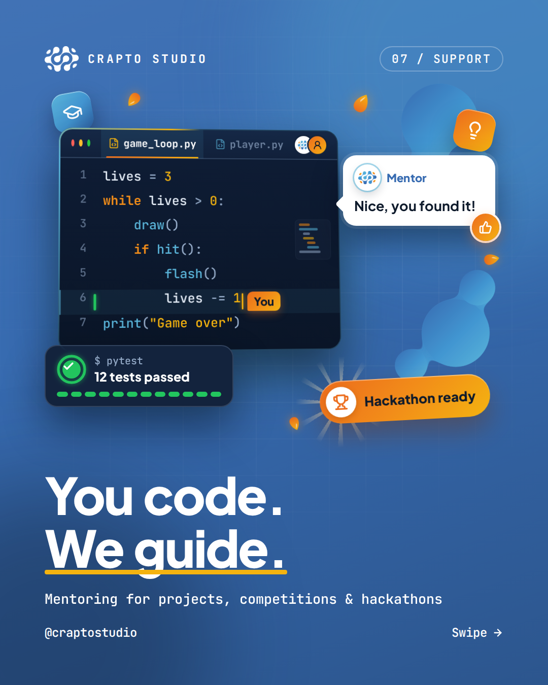 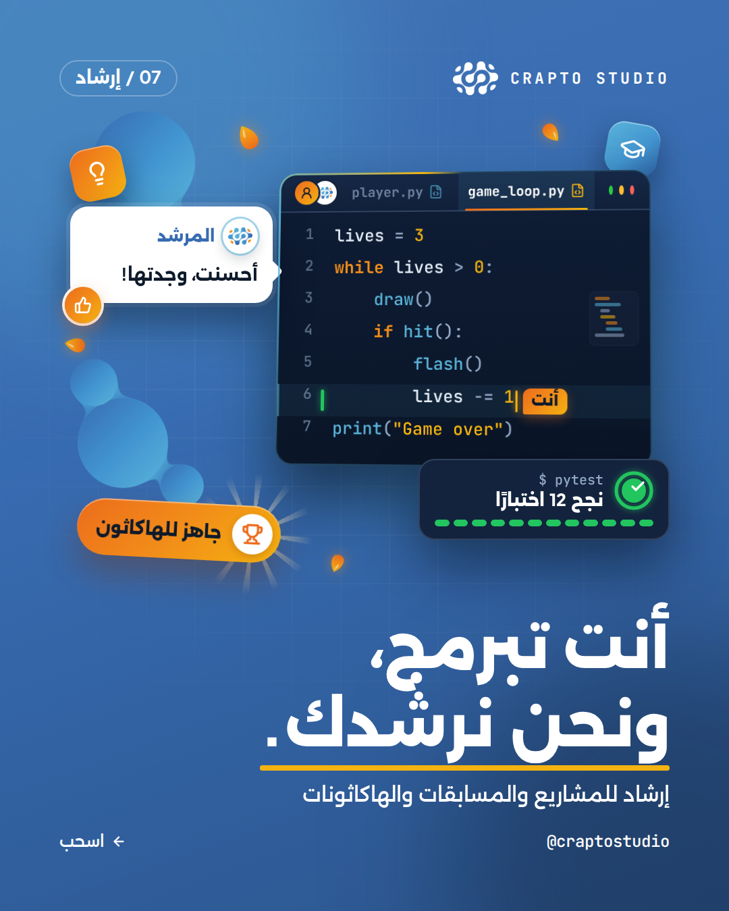</p>

| | |
|---|---|
| Final grid spots | Row 6 (bottom): AR middle, EN right. EN is upload 1, AR is upload 2 |
| Theme | Blue |
| Hero animation | A code editor with a bug: a game loop that never ends. The mentor never touches the code: a comment bubble pops up beside the bug and asks a guiding question. The student's own cursor (with a "you" name tag) moves to the right line and types the fix, the error underline disappears, the tests pass and a hackathon-ready badge pops. The cover shows the solved state, with the mentor's praise. In Arabic the code stays left-to-right and the layout mirrors around it. |
| EN files | `../exports/posts/01-support/en/` → `01-hero.mp4` (or `01-cover.png`), `02.png`, `03.png` |
| AR files | `../exports/posts/01-support/ar/` → `01-hero.mp4` (or `01-cover.png`), `02.png`, `03.png` |
| Highlight | Support · إرشاد |

**Slides**

| File | Slide | English | Arabic |
|---|---|---|---|
| `01-hero.mp4` | Hero | Tag "07 / Support" · "You code. *We guide.*" · "Mentoring for projects, competitions & hackathons" | «07 / إرشاد» · «أنت تبرمج، *ونحن نرشدك.*» · «إرشاد للمشاريع والمسابقات والهاكاثونات» |
| `02.png` | Cards: "How we help" / «كيف نساعدك» | Project mentoring · Debugging sessions · Competition prep · You build. We explain. | إرشاد في مشروعك · جلسات تصحيح الأخطاء · التحضير للمسابقات · أنت تبني، ونحن نشرح. |
| `03.png` | CTA (this post's own headline) | "Stuck on a project? *Let’s work it out.*" + the standard line | «عالق في مشروع؟ *لنجد الحل معاً.*» + the standard line |

**English caption** (hook: 104 characters)

```
Stuck on a programming project, or getting ready for a hackathon? You don't have to figure it out alone.

We mentor students and teams. You write the code; we help you find the problem and explain the "why" behind each fix.
That way you understand every line, and you can explain it to your teacher or the judges.
Please check your school's or competition's rules on outside help first. We work within them.

DM us "START" with your project, your deadline and where you're stuck.

#craptostudio #hackathon #programming #learntocode #computerscience
```

**Arabic caption** (hook: 73 characters)

```
عالق في مشروعك البرمجي أو تستعد لهاكاثون؟ لست مضطراً إلى حلّ كل شيء وحدك.

نرشد الطلاب والفرق، ولا ننجز المشروع نيابةً عنك: أنت تكتب الكود، ونحن نساعدك على اكتشاف الخطأ ونشرح لك السبب وراء كل إصلاح.
هكذا تفهم كل سطر في مشروعك، وتستطيع شرحه لأستاذك أو للجنة التحكيم.
راجع أولاً قواعد مدرستك أو جامعتك أو المسابقة بشأن المساعدة الخارجية، فنحن نعمل في حدودها.

راسلنا بكلمة «ابدأ» وأخبرنا عن مشروعك وموعد التسليم والنقطة التي تعثّرت عندها.

#برمجة #تعلم_البرمجة #هاكاثون #علوم_الحاسب #craptostudio
```

**Alt text** (cover)

```
Blue cover: code editor where a student fixed a bug with a mentor's hint. "You code. We guide."
```

```
غلاف أزرق: محرر كود أصلح فيه الطالب الخطأ بتوجيه من المرشد، وعبارة «أنت تبرمج، ونحن نرشدك.»
```

**Posting notes**

- This is your first upload, so for now it sits alone at the top-left. That's expected. After upload 2, the Arabic post sits left of it.
- Keep the mentoring framing everywhere, in both languages: guidance, reviews and explanations; the student does the work. If a student asks you to "just do it", use the mentoring saved reply (`mentor` or `armentor`) from [01-profile-setup.md](01-profile-setup.md#9-dm-setup).
- No location or collab needed. Later, if you mentor at a real hackathon, you can invite the organiser as a collaborator on that post (only if they agree).

---

### Post 2 — Interactive (EN + AR)

<p>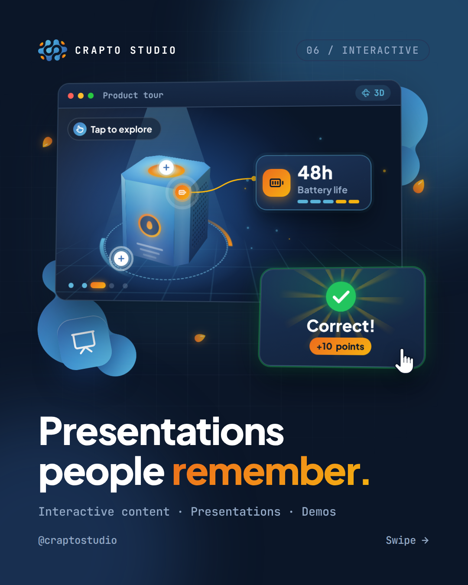 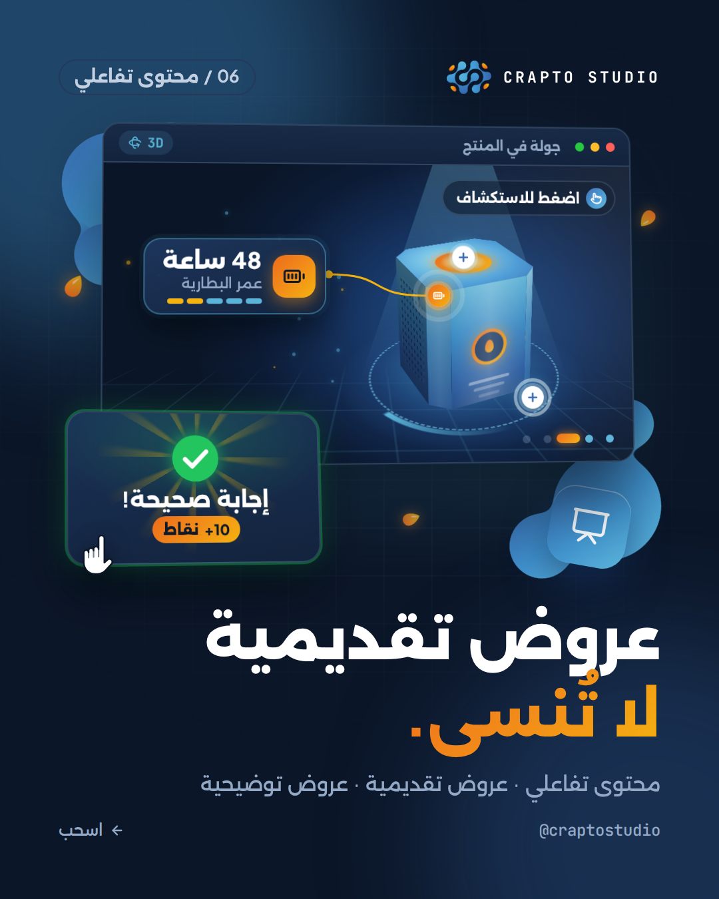</p>

| | |
|---|---|
| Final grid spots | AR row 5 right, EN row 6 left (the pair wraps across two rows). EN is upload 3, AR is upload 4 |
| Theme | Dark |
| Hero animation | A presentation that responds. A 3D product turns on a turntable inside a slide; a hand cursor taps a pulsing hotspot and an info card pops out. Then a quiz card rises out of the screen, the right answer is tapped and the card flips to confirm it with a burst of the logo's orange petals while the slide dots move on. The cover shows the finished state: info card open, quiz answered correctly. |
| EN files | `../exports/posts/02-interactive/en/` → `01-hero.mp4` (or `01-cover.png`), `02.png`, `03.png` |
| AR files | `../exports/posts/02-interactive/ar/` → `01-hero.mp4` (or `01-cover.png`), `02.png`, `03.png` |
| Highlight | Interactive · تفاعلي |

**Slides**

| File | Slide | English | Arabic |
|---|---|---|---|
| `01-hero.mp4` | Hero | Tag "06 / Interactive" · "Presentations people *remember*." · "Interactive content · Presentations · Demos" | «06 / محتوى تفاعلي» · «عروض تقديمية *لا تُنسى*.» · «محتوى تفاعلي · عروض تقديمية · عروض توضيحية» |
| `02.png` | Cards: "What we build" / «ماذا نصمّم» | Interactive pitch decks · Touchscreen & kiosk apps · Lessons & quizzes · 3D product demos | عروض تقديمية تفاعلية · تطبيقات شاشات اللمس · دروس واختبارات تفاعلية · عروض منتجات ثلاثية الأبعاد |
| `03.png` | CTA | Standard | Standard |

**English caption** (hook: 75 characters)

```
Slides get skimmed. Things people can tap, play and explore get remembered.

We build interactive content for brands, marketers, teachers and event teams.
Picture a pitch deck you click through like an app, a product you can turn in 3D, or a quiz on a touchscreen at your event stand.
Our game-development side helps here: the same skills that make games fun make content people want to touch.

Planning an event, a launch or a course? DM us "START" with the date and your idea.

#craptostudio #interactivecontent #presentationdesign #eventtech #gamification
```

**Arabic caption** (hook: 86 characters)

```
الشرائح العادية تُتصفَّح على عجل، أما ما يمكن لمسه وتجربته واستكشافه فيبقى في الذاكرة.

نصمّم محتوى تفاعلياً للعلامات التجارية وفرق التسويق والمعلّمين ومنظّمي الفعاليات.
تخيّل عرضاً تقديمياً تتنقّل فيه كأنه تطبيق، أو منتجاً ثلاثي الأبعاد تديره وتستكشفه من كل الزوايا، أو اختباراً سريعاً على شاشة لمس في جناحك بالمعرض.
خبرتنا في تطوير الألعاب تفيدنا هنا: ما يجعل اللعبة ممتعة هو نفسه ما يدفع الناس إلى التفاعل مع المحتوى.

تخطّط لفعالية أو إطلاق منتج أو دورة تدريبية؟ راسلنا بكلمة «ابدأ» وأخبرنا بالموعد وبفكرتك.

#عروض_تقديمية #محتوى_تفاعلي #التسويق_الرقمي #فعاليات #craptostudio
```

**Alt text** (cover)

```
Dark cover: interactive slide with a 3D product, an info card and a quiz answered correctly.
```

```
غلاف داكن: شريحة تفاعلية فيها منتج ثلاثي الأبعاد وبطاقة معلومات واختبار بإجابة صحيحة.
```

**Posting notes**

- No location needed. When you later post a real event build, add that event's location to that post.
- Nice to have later: a short clip of a real interactive piece in use, saved to the Interactive highlight.

---

### Post 3 — Upgrades (EN + AR)

<p>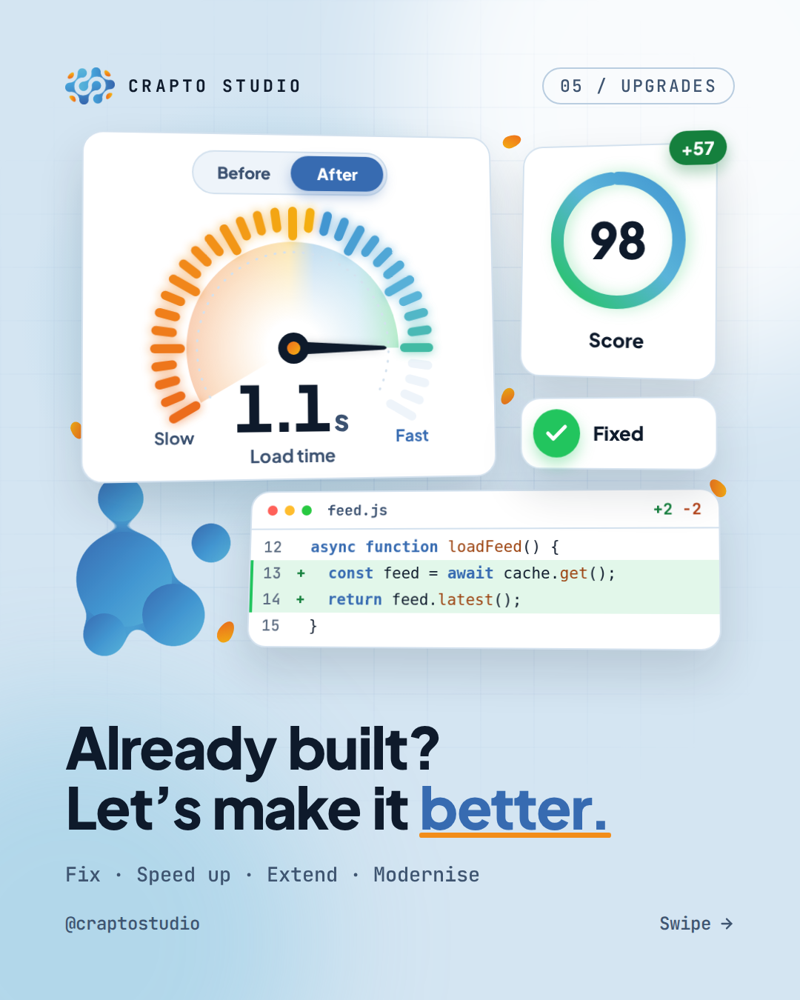 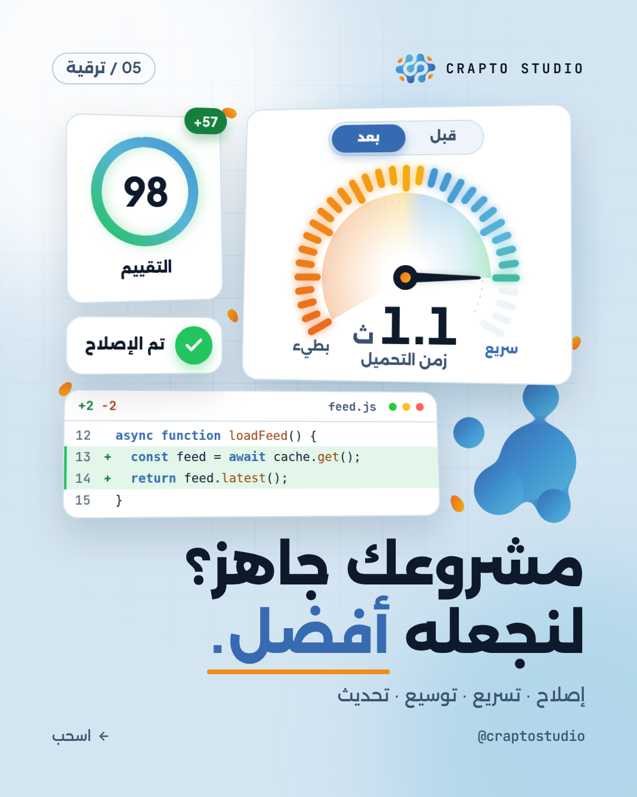</p>

| | |
|---|---|
| Final grid spots | Row 5: AR left, EN middle. EN is upload 5, AR is upload 6 |
| Theme | Light |
| Hero animation | An existing app gets upgraded. A Before/After switch flips, the code diff swaps the slow lines for fast ones, the bug turns into a check mark, and a speed gauge's needle swings from the slow (orange) zone into the fast (blue/green) zone while the load time drops and the score ring climbs. The cover shows the finished "After" state. |
| EN files | `../exports/posts/03-upgrades/en/` → `01-hero.mp4` (or `01-cover.png`), `02.png`, `03.png` |
| AR files | `../exports/posts/03-upgrades/ar/` → `01-hero.mp4` (or `01-cover.png`), `02.png`, `03.png` |
| Highlight | Upgrades · ترقية |

**Slides**

| File | Slide | English | Arabic |
|---|---|---|---|
| `01-hero.mp4` | Hero | Tag "05 / Upgrades" · "Already built? Let’s make it *better*." · "Fix · Speed up · Extend · Modernise" | «05 / ترقية» · «مشروعك جاهز؟ لنجعله *أفضل.*» · «إصلاح · تسريع · توسيع · تحديث» |
| `02.png` | Cards: "What we do" / «ماذا نقدّم» | Code health check · Speed & bug fixes · New features · Updates & redesigns | فحص شامل للكود · تسريع وإصلاح الأخطاء · ميزات جديدة · تحديثات وإعادة تصميم |
| `03.png` | CTA | Standard | Standard |

**English caption** (hook: 88 characters)

```
Your app, game or software might not need a rebuild. It might just need the right fixes.

We start with a health check: we run your project, read the code and list what's broken or slow.
Then you get a clear plan: what to fix first, what can wait, and what isn't worth paying for. If starting over really is the better choice, we'll tell you honestly.
It doesn't matter who wrote the code: you, another studio, or a freelancer who has moved on.

DM us "START" with a link to your project and what's bothering you about it.

#craptostudio #codereview #refactoring #bugfix #appdevelopment
```

**Arabic caption** (hook: 93 characters)

```
قد لا يحتاج تطبيقك أو لعبتك أو برنامجك إلى إعادة بناء من الصفر، بل إلى الإصلاحات الصحيحة فقط.

نبدأ كل ترقية بفحص شامل: نشغّل مشروعك ونقرأ الكود ونحدّد ما هو معطّل أو بطيء.
ثم تحصل على خطة واضحة: ما يُصلَح أولاً، وما يمكن تأجيله، وما لا يستحق أن تدفع مقابله. وإن كانت إعادة البناء هي الخيار الأفضل فعلاً، فسنخبرك بصراحة.
لا يهمّ من كتب الكود: أنت، أو استوديو آخر، أو مطوّر مستقل انتقل إلى مشروع آخر.

راسلنا بكلمة «ابدأ» مع رابط مشروعك، وأخبرنا بما يزعجك فيه.

#برمجة #تطوير_البرمجيات #تطوير_التطبيقات #تقنية #craptostudio
```

**Alt text** (cover)

```
Light cover: app upgrade with a Before/After switch, fixed code and a speed gauge in the fast zone.
```

```
غلاف فاتح: ترقية تطبيق مع مفتاح قبل/بعد وكود مُصلَح ومؤشر سرعة في المنطقة السريعة.
```

**Posting notes**

- **Check point (end of day 1):** two full rows are live. The top row should read Upgrades AR, Upgrades EN (both light), Interactive AR (dark); the second row Interactive EN (dark), Support AR, Support EN (both blue).
- The load time and score in the animation are sample numbers. Later, a real before/after (a fixed bug, a faster screen) is the best follow-up to this post. Only show real numbers, with the owner's permission.

---

### Post 4 — Software (EN + AR)

<p>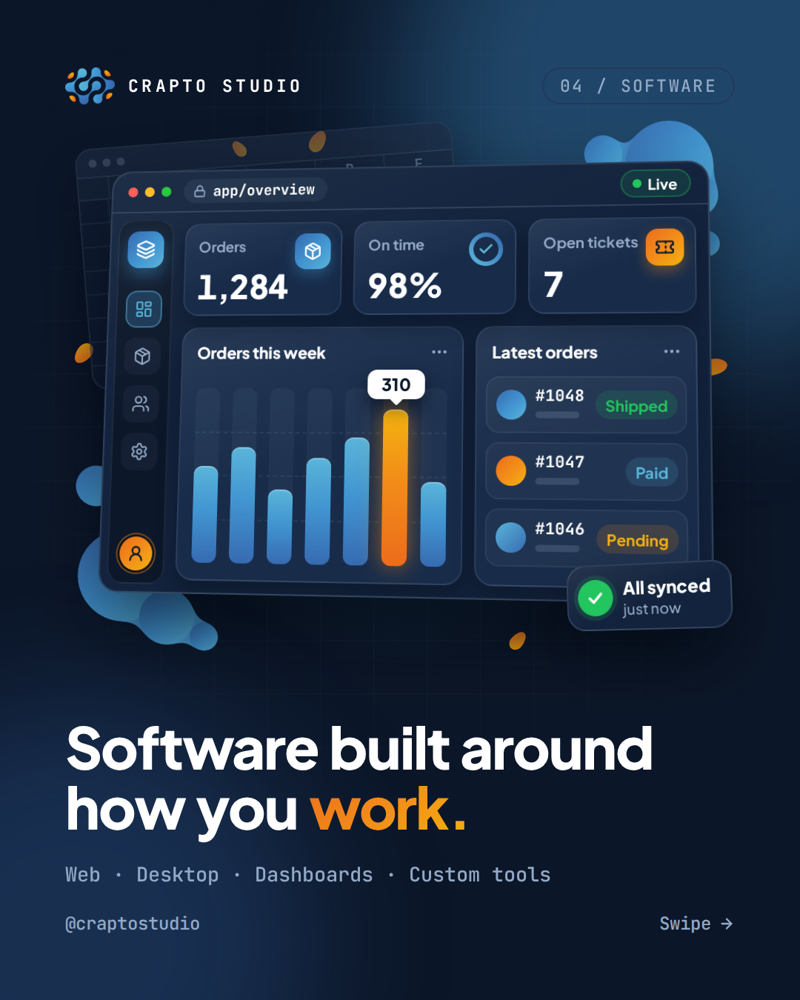 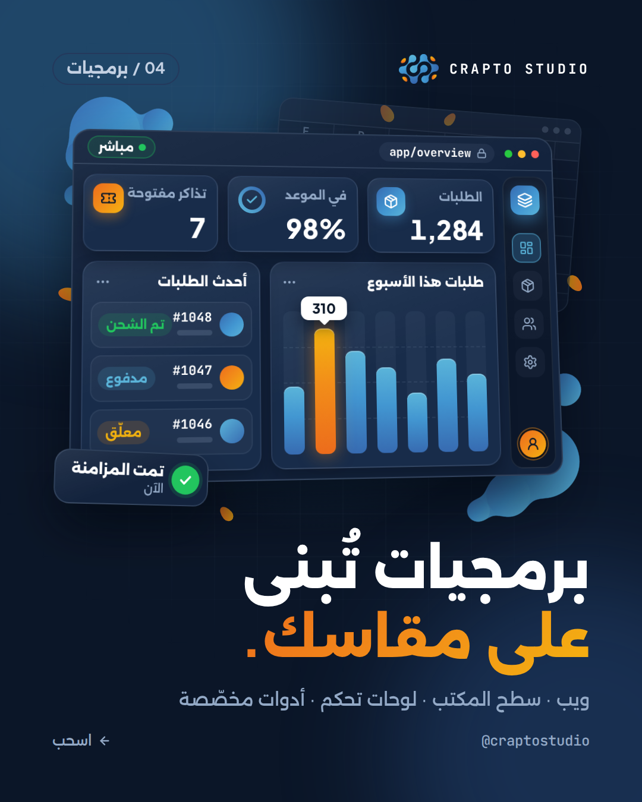</p>

| | |
|---|---|
| Final grid spots | Row 4: AR middle, EN right. EN is upload 7, AR is upload 8 |
| Theme | Dark |
| Hero animation | "From spreadsheet to system." A cramped spreadsheet full of error flags lifts off its grid cell by cell; the cells fly and reassemble into a clean custom dashboard: a sidebar, number cards that count up, a bar chart that grows, and a table of orders with status labels. The cover shows the finished dashboard, with a ghost of the old sheet behind it. In Arabic the sheet and the dashboard are mirrored. |
| EN files | `../exports/posts/04-software/en/` → `01-hero.mp4` (or `01-cover.png`), `02.png`, `03.png` |
| AR files | `../exports/posts/04-software/ar/` → `01-hero.mp4` (or `01-cover.png`), `02.png`, `03.png` |
| Highlight | Software · برمجيات |

**Slides**

| File | Slide | English | Arabic |
|---|---|---|---|
| `01-hero.mp4` | Hero | Tag "04 / Software" · "Software built around how you *work*." · "Web · Desktop · Dashboards · Custom tools" | «04 / برمجيات» · «برمجيات تُبنى *على مقاسك*.» · «ويب · سطح المكتب · لوحات تحكم · أدوات مخصّصة» |
| `02.png` | Cards: "What we build" / «ماذا نبني» | Dashboards & portals · Spreadsheets → systems · APIs & integrations · Clean handover | لوحات تحكم وبوابات · من جداول البيانات إلى أنظمة · واجهات API وربط الأنظمة · تسليم منظّم وموثّق |
| `03.png` | CTA | Standard | Standard |

**English caption** (hook: 101 characters)

```
Still running your business on spreadsheets, copy-paste and long email threads? There's a better way.

Ready-made software often makes you change how you work. Custom software is built around it.
We start by looking at how your team works today: the steps, the files, the tasks you repeat every week.
Then we build in small steps, so you can try each part and give feedback while it's being built.

DM us "START" and tell us which task takes up the most time in your week.

#craptostudio #softwaredevelopment #webdevelopment #webapp #businesssoftware
```

**Arabic caption** (hook: 86 characters)

```
ما زلت تدير عملك بجداول البيانات والنسخ واللصق ورسائل البريد التي لا تنتهي؟ هناك طريقة أفضل.

البرامج الجاهزة تفرض عليك غالباً أن تغيّر طريقة عملك، أما البرمجيات المخصّصة فتُبنى على مقاسك.
نبدأ بفهم ما يجري في فريقك اليوم: الخطوات والملفات والمهام التي تتكرّر كل أسبوع.
ثم نبني على مراحل صغيرة، فتجرّب كل جزء وتشاركنا ملاحظاتك أولاً بأول.

راسلنا بكلمة «ابدأ» وأخبرنا: ما المهمة التي تستهلك معظم وقتك كل أسبوع؟

#تطوير_البرمجيات #برمجيات #التحول_الرقمي #ريادة_الأعمال #craptostudio
```

**Alt text** (cover)

```
Dark cover: a messy spreadsheet turned into a clean dashboard with charts and an orders table.
```

```
غلاف داكن: جدول بيانات مزدحم يتحوّل إلى لوحة تحكم أنيقة فيها رسم بياني وجدول طلبات.
```

**Posting notes**

- No location or collab needed.
- The spreadsheet and dashboard in the animation hold sample data. When you show real software later, blur names, emails and any private data.

---

### Post 5 — Custom AI (EN + AR)

<p>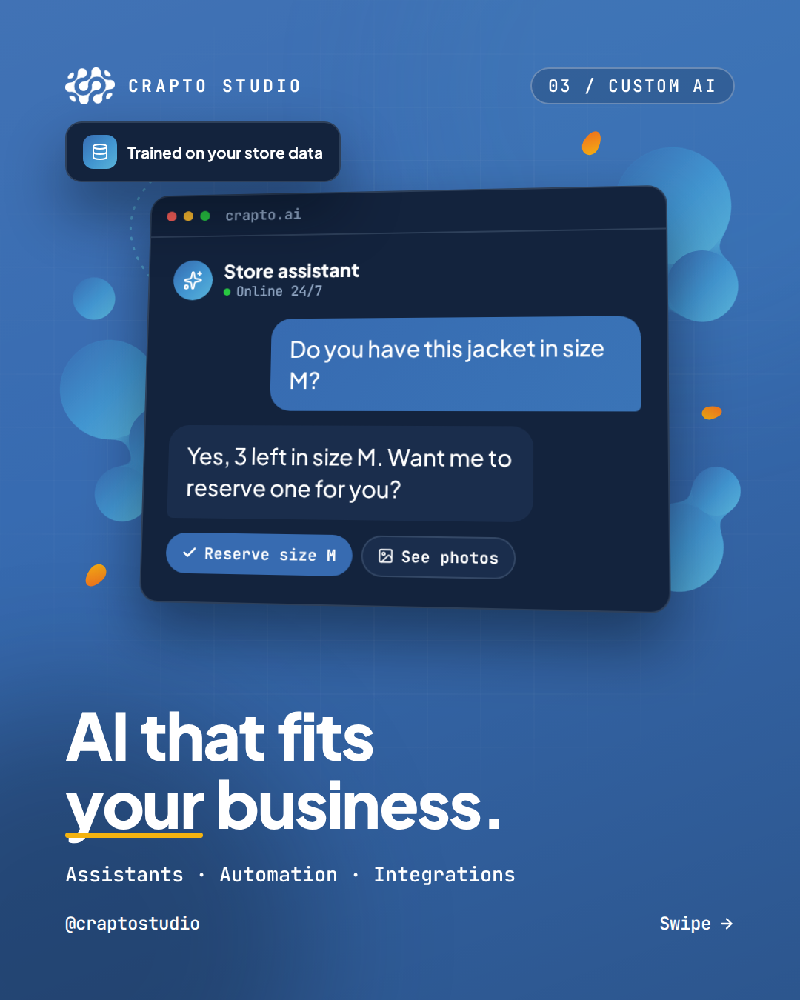 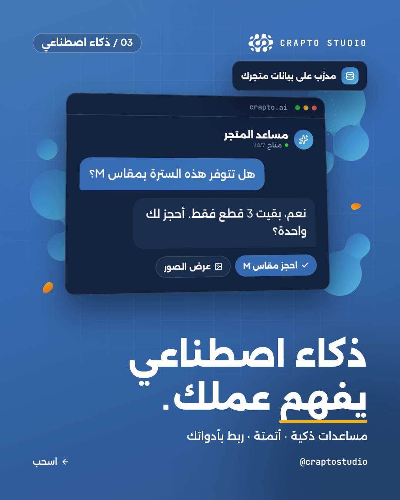</p>

| | |
|---|---|
| Final grid spots | AR row 3 right, EN row 4 left (the pair wraps across two rows, in the middle of the grid). EN is upload 9, AR is upload 10 |
| Theme | Blue |
| Hero animation | A store assistant answers a customer live. The customer asks whether a jacket comes in size M; a spark runs from a card standing for the store's own data to the chat, typing dots appear, the answer streams in word by word and two reply buttons pop up (reserve, see photos). Soft blue blobs that echo the logo drift behind the chat window. The cover shows the finished conversation. |
| EN files | `../exports/posts/05-ai/en/` → `01-hero.mp4` (or `01-cover.png`), `02.png`, `03.png` |
| AR files | `../exports/posts/05-ai/ar/` → `01-hero.mp4` (or `01-cover.png`), `02.png`, `03.png` |
| Highlight | AI · ذكاء اصطناعي |

**Slides**

| File | Slide | English | Arabic |
|---|---|---|---|
| `01-hero.mp4` | Hero | Tag "03 / Custom AI" · "AI that fits *your* business." · "Assistants · Automation · Integrations" | «03 / ذكاء اصطناعي» · «ذكاء اصطناعي *يفهم* عملك.» · «مساعدات ذكية · أتمتة · ربط بأدواتك» |
| `02.png` | Cards: "What we build" / «ماذا نبني» | AI assistants · Automations · AI inside your app · Honest advice | مساعدات ذكية · أتمتة المهام · ذكاء اصطناعي داخل تطبيقك · نصيحة صادقة |
| `03.png` | CTA | Standard | Standard |

**English caption** (hook: 91 characters)

```
AI is only useful when it solves a real problem in your business. So that's where we start.

First we ask: what takes too long, what gets repeated, what gets missed?
Then we choose the simplest fix. Sometimes that's AI. Sometimes it's a basic automation with no AI at all.
We can start with a small test on your own examples, and we'll explain in plain words where your data goes and who can see it.

Got a task you wish would run by itself? DM us "START" and describe it in one sentence.

#craptostudio #artificialintelligence #aiautomation #aiforbusiness #chatbot
```

**Arabic caption** (hook: 73 characters)

```
الذكاء الاصطناعي لا يفيدك إلا إذا حلّ مشكلة حقيقية في عملك، ومن هنا نبدأ.

نسأل أولاً: ما الذي يستغرق وقتاً طويلاً؟ ما الذي يتكرّر؟ وما الذي يضيع بين الرسائل والملفات؟
ثم نختار أبسط حل: قد يكون ذكاءً اصطناعياً، وقد يكون أتمتة بسيطة لا تحتاج إليه أصلاً.
يمكننا البدء بتجربة صغيرة على أمثلة من عملك، ونشرح لك بوضوح أين تذهب بياناتك ومن يمكنه الاطلاع عليها.

لديك مهمة تتمنى لو أنها تُنجَز تلقائياً؟ راسلنا بكلمة «ابدأ» وصِفها في جملة واحدة.

#الذكاء_الاصطناعي #التحول_الرقمي #ريادة_الأعمال #تقنية #craptostudio
```

**Alt text** (cover)

```
Blue cover: a store's AI assistant confirms a jacket is in stock in size M, in a chat window.
```

```
غلاف أزرق: مساعد ذكي لمتجر يجيب عميلاً عن توفّر سترة بمقاس M في نافذة محادثة.
```

**Posting notes**

- This pair ends up in the middle of the grid once all 18 are live. Until then it moves with each new post. That's expected.
- The store conversation is a demo. Don't add promises like "save 10 hours a week" unless you have measured it on a real project.

---

### Post 6 — Apps (EN + AR)

<p>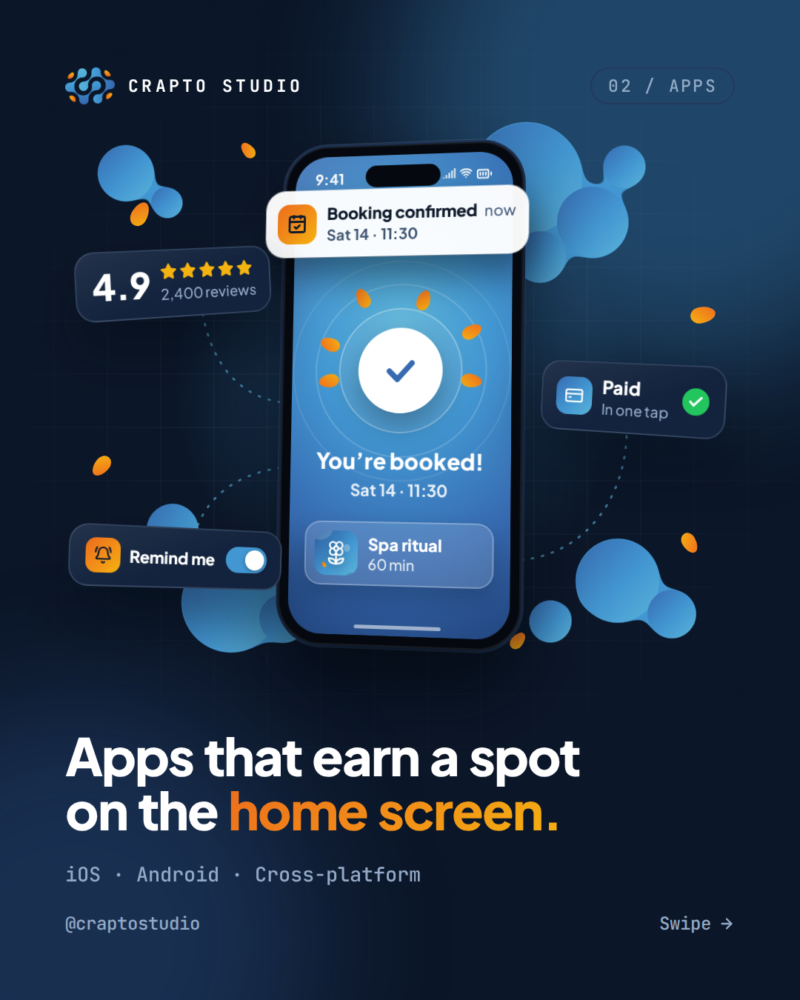 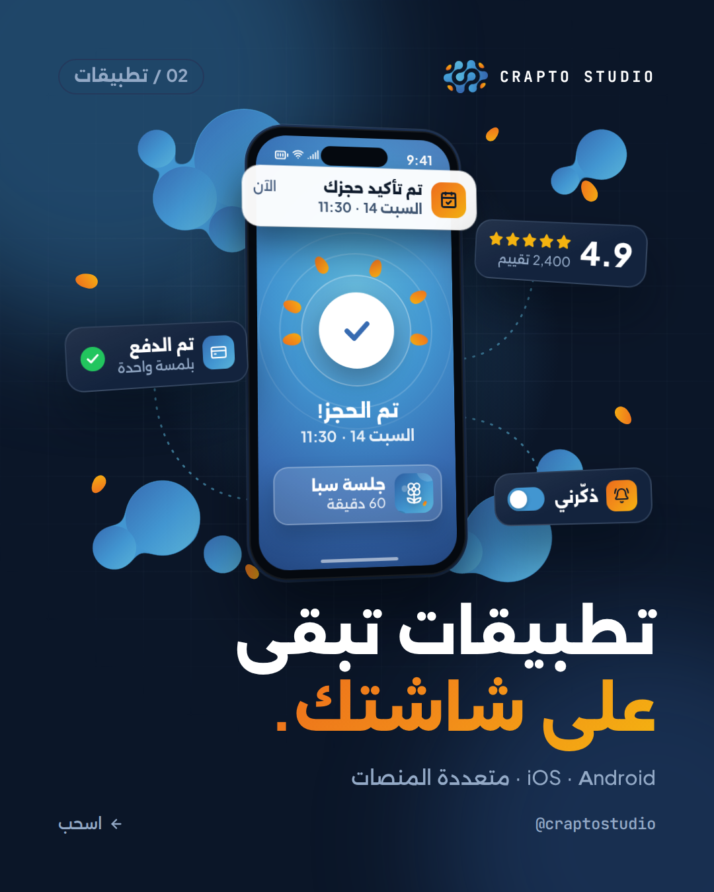</p>

| | |
|---|---|
| Final grid spots | Row 3: AR left, EN middle. EN is upload 11, AR is upload 12 |
| Theme | Dark |
| Hero animation | A booking app comes alive on a floating, tilted phone. Tap a service, the photo grows into the detail page, pick a time, book, and a booking-confirmed banner pops out of the screen while orange petals burst out of the phone. Floating cards around it (rating, payment, reminder) react to the same story. The cover shows the finished booking. |
| EN files | `../exports/posts/06-apps/en/` → `01-hero.mp4` (or `01-cover.png`), `02.png`, `03.png` |
| AR files | `../exports/posts/06-apps/ar/` → `01-hero.mp4` (or `01-cover.png`), `02.png`, `03.png` |
| Highlight | Apps · تطبيقات |

**Slides**

| File | Slide | English | Arabic |
|---|---|---|---|
| `01-hero.mp4` | Hero | Tag "02 / Apps" · "Apps that earn a spot on the *home screen*." · "iOS · Android · Cross-platform" | «02 / تطبيقات» · «تطبيقات تبقى *على شاشتك*.» · «iOS · Android · متعددة المنصات» |
| `02.png` | Cards: "What we build" / «ماذا نبني» | iOS & Android apps · UI/UX design · Payments & accounts · Store launch & updates | تطبيقات iOS و Android · تصميم UI/UX · الدفع والحسابات · الإطلاق في المتاجر والتحديثات |
| `03.png` | CTA | Standard | Standard |

**English caption** (hook: 90 characters)

```
An app is only worth building if people open it again tomorrow. That's what we design for.

Not sure if you need a native app, a cross-platform app or just a good website? We'll help you choose, and we'll say so if a website is enough.
"Native" means built separately for iOS and for Android. "Cross-platform" means one shared set of code for both, which can save time.
We start with the one thing your app must do really well, and build from there.

Got an app idea? DM us "START" and tell us about it in one sentence.

#craptostudio #appdevelopment #iosdev #androiddev #mobileapp
```

**Arabic caption** (hook: 82 characters)

```
التطبيق الناجح هو الذي يفتحه الناس من جديد في اليوم التالي، وهذا ما نصمّم من أجله.

لست متأكداً مما تحتاج إليه: تطبيق أصلي أم متعدد المنصات أم مجرد موقع جيد؟ نساعدك على الاختيار، ونخبرك بصراحة إن كان الموقع يكفي.
التطبيق الأصلي (Native) يُبنى لكل من iOS و Android على حدة، أما التطبيق متعدد المنصات فيعتمد على كود واحد للنظامين، وقد يوفّر ذلك الوقت.
نبدأ بالمهمة الأهم التي يجب أن يتقنها تطبيقك، ثم نبني عليها.

لديك فكرة تطبيق؟ راسلنا بكلمة «ابدأ» وأخبرنا عنها في جملة واحدة.

#تطبيقات_الجوال #تطوير_التطبيقات #برمجة_تطبيقات #تجربة_المستخدم #craptostudio
```

**Alt text** (cover)

```
Dark cover: a booking app on a floating phone confirms a session, with rating and payment cards.
```

```
غلاف داكن: تطبيق حجز على هاتف عائم يؤكد موعد الجلسة، مع بطاقتي التقييم والدفع.
```

**Posting notes**

- **Check point (end of day 2):** four full rows are live. The top row should read Apps AR, Apps EN (both dark), Custom AI AR (blue). The six posts from day 1 are now rows 3–4 and will drop to rows 5–6 tomorrow.
- The app in the animation is a sample (its rating and review count are part of the mock screen, not real figures). No location or collab needed.

---

### Post 7 — Start here (EN + AR)

<p>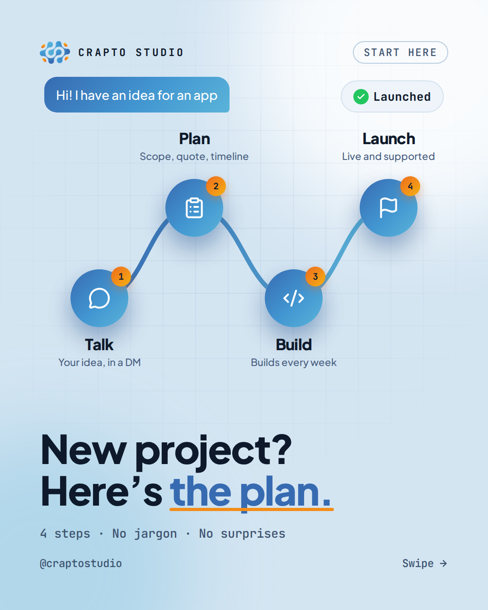 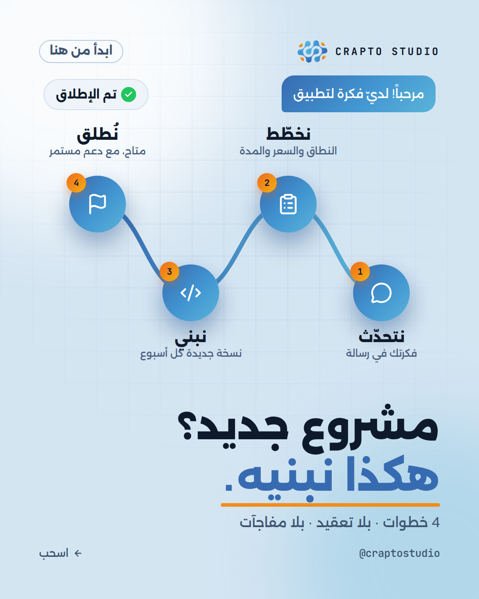</p>

| | |
|---|---|
| Final grid spots | Row 2: AR middle, EN right. EN is upload 13, AR is upload 14 |
| Theme | Light |
| Hero animation | The four-step journey. A chat bubble with a new idea opens the story, then an orange spark travels a curved path through Talk, Plan, Build and Launch, lighting each step as it arrives. A launch badge pops at the end with a small burst of sparks. In Arabic the path runs right to left. The cover shows all four steps lit. |
| EN files | `../exports/posts/07-start/en/` → `01-hero.mp4` (or `01-cover.png`), `02.png`, `03.png`, `04.png` |
| AR files | `../exports/posts/07-start/ar/` → `01-hero.mp4` (or `01-cover.png`), `02.png`, `03.png`, `04.png` |
| Highlight | Start · ابدأ |

**Slides**

| File | Slide | English | Arabic |
|---|---|---|---|
| `01-hero.mp4` | Hero | Tag "Start here" · "New project? Here’s *the plan.*" · "4 steps · No jargon · No surprises" | «ابدأ من هنا» · «مشروع جديد؟ *هكذا نبنيه.*» · «4 خطوات · بلا تعقيد · بلا مفاجآت» |
| `02.png` | Steps: "How we work" / «كيف نعمل» | 1 Talk: Tell us your idea. DM “START”. · 2 Plan: Clear scope, quote & timeline. · 3 Build: Real progress every week. · 4 Launch & support: We ship it and stay around. | 1 نتحدّث: أخبرنا بفكرتك. راسلنا بكلمة «ابدأ». · 2 نخطّط: نطاق واضح وعرض سعر وجدول زمني. · 3 نبني: تقدّم حقيقي تراه كل أسبوع. · 4 نُطلق وندعم: نسلّم مشروعك ونبقى معك. |
| `03.png` | Cards: "Send us this first" / «أرسل لنا هذه أولاً» | Your idea, in one line · Who it’s for · Your deadline · Your budget range | فكرتك في سطر واحد · جمهورك المستهدف · موعدك النهائي · ميزانيتك التقريبية |
| `04.png` | CTA | Standard | Standard |

**English caption** (hook: 88 characters)

```
Not sure how to start a project with a tech studio? Here's the whole process in 4 steps.

You don't need a technical plan to start. A rough idea is enough. Asking the right questions is our job.
Don't know your budget yet? A rough range is fine. It helps us suggest the right size for a first version.
Not sure what to build? Tell us the problem instead, and we'll help you shape the idea.

Save this post for the checklist, then DM us "START" or tap the link in bio when you're ready.

#craptostudio #startup #smallbusiness #productdevelopment #appdevelopment
```

**Arabic caption** (hook: 72 characters)

```
لا تعرف كيف تبدأ مشروعاً مع استوديو تقني؟ إليك الطريق كاملاً في 4 خطوات.

لا تحتاج إلى خطة تقنية لتبدأ، فالفكرة المبدئية تكفي، وطرح الأسئلة الصحيحة مهمتنا نحن.
لم تحدّد ميزانيتك بعد؟ يكفي نطاق تقريبي يساعدنا على اقتراح الحجم المناسب للنسخة الأولى.
لا تعرف ماذا تبني بالضبط؟ أخبرنا بالمشكلة، وسنساعدك على بلورة الفكرة.

احفظ هذا المنشور لتعود إلى القائمة، ثم راسلنا بكلمة «ابدأ» أو اضغط على الرابط في الملف الشخصي متى كنت جاهزاً.

#ريادة_الأعمال #الشركات_الناشئة #مشاريع_صغيرة #برمجة #craptostudio
```

**Alt text** (cover)

```
Light cover: four steps, Talk, Plan, Build, Launch, joined by a path, with a "Launched" badge.
```

```
غلاف فاتح: أربع خطوات، نتحدّث ونخطّط ونبني ونُطلق، يربطها مسار، مع شارة «تم الإطلاق».
```

**Posting notes**

- This is the most useful pair for new visitors. When you share it to your story, add a **link sticker** to `[your project brief form link]` before saving it to the Start highlight.
- The "Send us this first" slide asks for four things. The START and «ابدأ» saved replies (`start`, `arstart`) ask for the same four, plus links or apps people like, so the slide and the DM match ([01-profile-setup.md, DM setup](01-profile-setup.md#9-dm-setup)). If you change one, change the other.
- One Start post (in your main language) is the best long-term pin. Pinning it moves it out of row 2 and changes the top two rows, so do it once launch week is over (option 2 in [01-profile-setup.md, pinned posts](01-profile-setup.md#10-pinned-posts); see also [Pinning](#pinning-reorders-the-grid)).

---

### Post 8 — Games (EN + AR)

<p>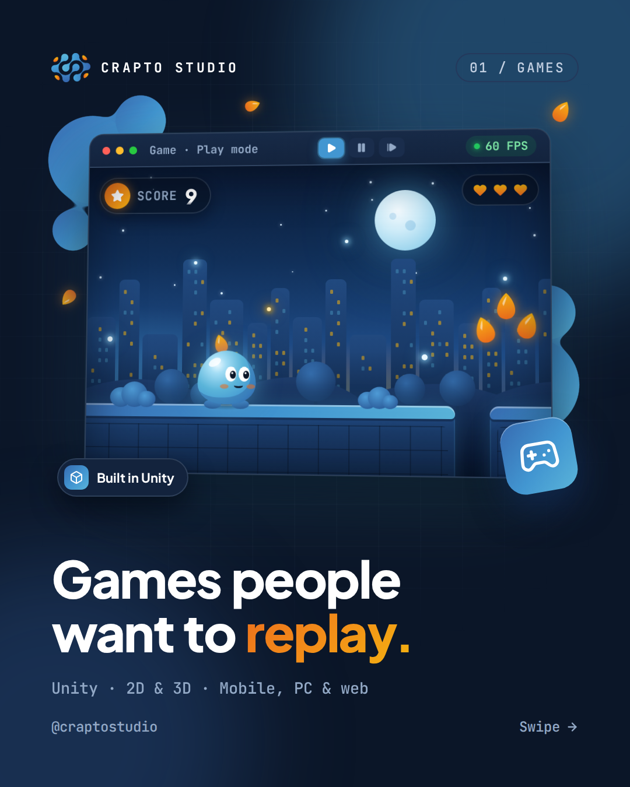 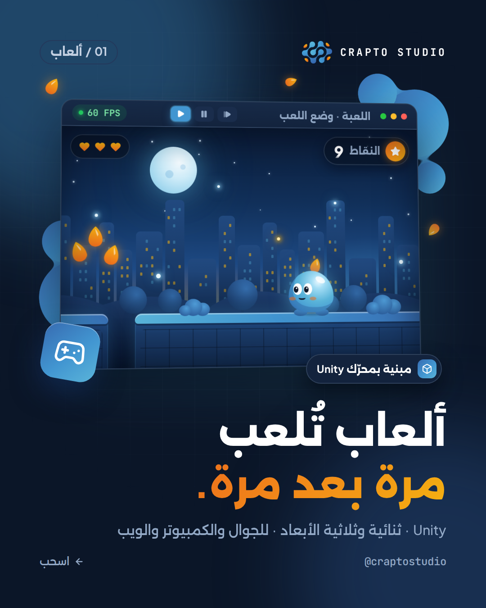</p>

| | |
|---|---|
| Final grid spots | AR row 1 right, EN row 2 left (the pair wraps across two rows). EN is upload 15, AR is upload 16 |
| Theme | Dark |
| Hero animation | A playable-looking 2D platformer running in a Unity-style game window. A round blob hero runs and jumps across brand-blue platforms through a night city, collecting the logo's orange petals; each one pops and flies into the score badge. Midway, an iris wipe restarts the level and the score rolls back, then a fresh run collects the petals again and ends on the same score as the first frame. The cover shows the game mid-run. |
| EN files | `../exports/posts/08-games/en/` → `01-hero.mp4` (or `01-cover.png`), `02.png`, `03.png` |
| AR files | `../exports/posts/08-games/ar/` → `01-hero.mp4` (or `01-cover.png`), `02.png`, `03.png` |
| Highlight | Games · ألعاب |

**Slides**

| File | Slide | English | Arabic |
|---|---|---|---|
| `01-hero.mp4` | Hero | Tag "01 / Games" · "Games people want to *replay*." · "Unity · 2D & 3D · Mobile, PC & web" | «01 / ألعاب» · «ألعاب تُلعب *مرة بعد مرة*.» · «Unity · ثنائية وثلاثية الأبعاد · للجوال والكمبيوتر والويب» |
| `02.png` | Cards: "What we build" / «ماذا نبني» | Full Unity games · Playable prototypes · Advergames for brands · Game feel & polish | ألعاب Unity متكاملة · نماذج أولية قابلة للعب · ألعاب تسويقية للعلامات التجارية · متعة اللعب واللمسات الأخيرة |
| `03.png` | CTA | Standard | Standard |

**English caption** (hook: 96 characters)

```
A game idea is easy to explain. Making it fun to play is the hard part. That's the part we love.

Not sure your idea works yet? Start with a playable prototype: a small version of the core game that real players can test before you build the full thing.
We care about "game feel": how a jump, a hit or a button press feels in your hands. It's the difference between a game people try once and one they replay.
Brands: a short branded game (an "advergame") gives people a reason to spend time with your product, by choice.

Got a game idea? DM us "START" and tell us about it in one sentence. 🎮

#craptostudio #gamedev #unity3d #madewithunity #indiedev
```

**Arabic caption** (hook: 77 characters)

```
شرح فكرة اللعبة سهل، أما جعلها ممتعة فهو التحدي الحقيقي، وهو بالضبط ما نحبّه.

لست متأكداً من فكرتك بعد؟ ابدأ بنموذج أولي قابل للعب: نسخة صغيرة من جوهر اللعبة يجرّبها لاعبون حقيقيون قبل بناء اللعبة كاملة.
نهتم كثيراً بما يُسمّى «متعة اللعب»: إحساس القفزة والضربة وضغطة الزر بين يديك، فهذا ما يجعل اللاعب يعود إلى اللعبة مرة بعد مرة.
وللعلامات التجارية: لعبة تسويقية قصيرة تمنح جمهورك سبباً ليقضي وقتاً مع منتجك باختياره.

لديك فكرة لعبة؟ راسلنا بكلمة «ابدأ» وأخبرنا عنها في جملة واحدة. 🎮

#تطوير_الألعاب #ألعاب_فيديو #صناعة_الألعاب #unity3d #craptostudio
```

**Alt text** (cover)

```
Dark cover: a 2D platformer in a Unity-style window, a blob hero collecting orange petals at night.
```

```
غلاف داكن: لعبة منصّات ثنائية الأبعاد في نافذة بأسلوب Unity، وبطل صغير يجمع بتلات برتقالية.
```

**Posting notes**

- Music is a nice fit here if you want it: a light, game-style instrumental track. Still optional.
- Games are the most visual service. Plan a real gameplay clip or work-in-progress Reel soon after launch (see [04-idea-bank.md](04-idea-bank.md)), but post it **after** upload 18, not in between.

---

### Post 9 — Intro (EN + AR)

<p>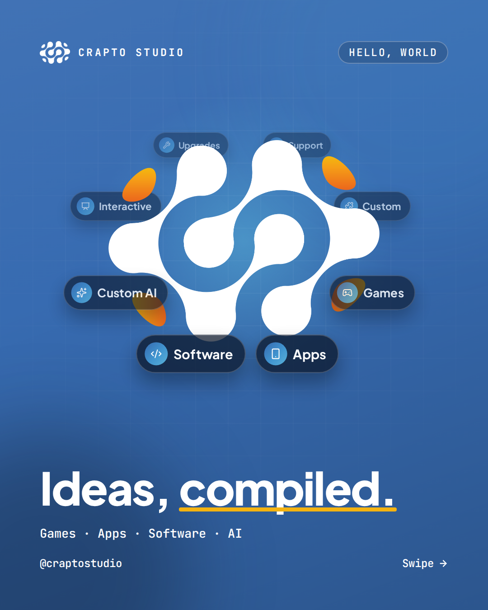 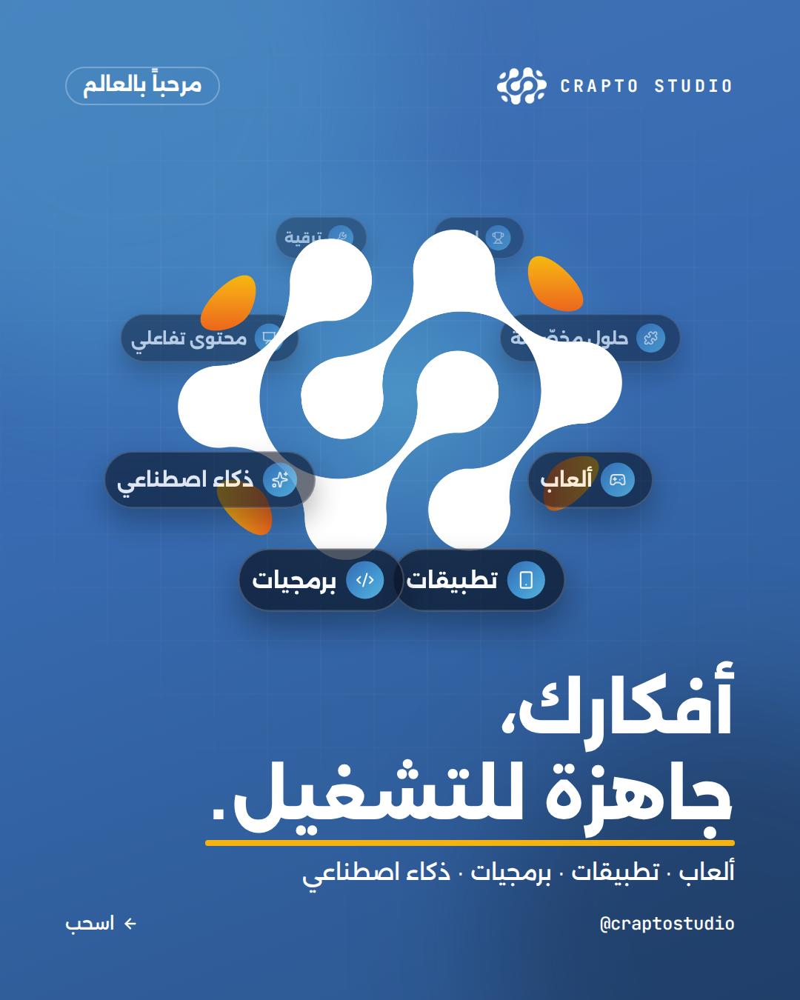</p>

| | |
|---|---|
| Final grid spots | Row 1 (top): AR left (the first post visitors see), EN middle. EN is upload 17, AR is upload 18 |
| Theme | Blue |
| Hero animation | The logo comes alive. The orange petals spin away, the white symbol melts into liquid droplets that scatter and flow back together, the symbol condenses again and the petals spin back into place one by one. All the while, the eight services circle the mark on a tilted orbit, one full turn per loop. The cover shows the complete symbol with the services around it. |
| EN files | `../exports/posts/09-intro/en/` → `01-hero.mp4` (or `01-cover.png`), `02.png`, `03.png`, `04.png`, `05.png` |
| AR files | `../exports/posts/09-intro/ar/` → `01-hero.mp4` (or `01-cover.png`), `02.png`, `03.png`, `04.png`, `05.png` |
| Highlight | Work · أعمالنا |

**Slides**

| File | Slide | English | Arabic |
|---|---|---|---|
| `01-hero.mp4` | Hero | Tag "Hello, world" · "Ideas, *compiled.*" · "Games · Apps · Software · AI" | «مرحباً بالعالم» · «أفكارك، *جاهزة للتشغيل.*» · «ألعاب · تطبيقات · برمجيات · ذكاء اصطناعي» |
| `02.png` | Statement: "// who we are" / «// من نحن» | "We *design and build* games, apps, software and AI." | «*نصمّم ونبني* ألعاباً وتطبيقات وبرمجيات وحلول ذكاء اصطناعي.» |
| `03.png` | Services: "What we do" / «ماذا نقدّم» | 8 cards: Games (Unity, 2D & 3D) · Apps (iOS & Android) · Software (Web, desktop & tools) · Custom AI (Chatbots & automation) · Interactive (Presentations & demos) · Upgrades (Fix, speed up, extend) · Support (Project mentoring) · Custom (Tell us the problem) | 8 بطاقات: ألعاب (Unity، ثنائية وثلاثية الأبعاد) · تطبيقات (iOS و Android) · برمجيات (ويب وسطح المكتب وأدوات) · ذكاء اصطناعي (مساعدات ذكية وأتمتة) · محتوى تفاعلي (عروض تقديمية وتوضيحية) · ترقية (إصلاح وتسريع وتوسيع) · إرشاد (للمشاريع والمسابقات) · حلول مخصّصة (أخبرنا بمشكلتك) |
| `04.png` | Steps: "Why work with us" / «لماذا تختارنا» | Honest scoping: If you don’t need it, we say so. · Weekly progress: Builds you can try, every week. · Clean handover: Documented code and project files. · We stick around: Support after launch. | صراحة من البداية: لا تحتاجه؟ سنخبرك بذلك. · تقدّم أسبوعي: نسخة جديدة تجرّبها كل أسبوع. · تسليم منظّم: كود موثّق وملفات المشروع كاملة. · نبقى معك: دعم مستمر بعد الإطلاق. |
| `05.png` | CTA | Standard | Standard |

**English caption** (hook: 110 characters)

```
Hello, world 👋 We're Crapto Studio, a tech studio that designs and builds games, apps, software and custom AI.

You bring the idea. We turn it into something that runs. That's what "Ideas, compiled." means.
We also upgrade projects that already exist, and mentor students and teams while they build their own projects.
We're here for startups, small businesses, brands, educators, event teams, game creators and students.
Follow along for our builds, behind-the-scenes and practical tips.

Got an idea? DM us "START" or tap the link in bio.

#craptostudio #gamedev #appdevelopment #softwaredevelopment #artificialintelligence
```

**Arabic caption** (hook: 114 characters)

```
مرحباً بالعالم 👋 نحن Crapto Studio، استوديو تقني يصمّم ويبني الألعاب والتطبيقات والبرمجيات وحلول الذكاء الاصطناعي.

أنت تأتي بالفكرة، ونحن نحوّلها إلى شيء يعمل فعلاً. هذا معنى «أفكارك، جاهزة للتشغيل».
ونقدّم أيضاً ترقية المشاريع القائمة، وإرشاد الطلاب والفرق وهم يبنون مشاريعهم البرمجية بأنفسهم.
خدماتنا موجّهة إلى الشركات الناشئة والمشاريع الصغيرة والعلامات التجارية والمعلّمين ومنظّمي الفعاليات وصنّاع الألعاب والطلاب.
تابعنا لتشاهد ما نبنيه وكواليس عملنا، ولتحصل على نصائح عملية.

لديك فكرة؟ راسلنا بكلمة «ابدأ» أو اضغط على الرابط في الملف الشخصي.

#برمجة #تطوير_الألعاب #تطبيقات_الجوال #الذكاء_الاصطناعي #craptostudio
```

**Alt text** (cover)

```
Blue cover: the white Crapto Studio symbol with eight service labels orbiting it. "Ideas, compiled."
```

```
غلاف أزرق: شعار Crapto Studio الأبيض تدور حوله الخدمات الثماني، وعبارة «أفكارك، جاهزة للتشغيل.»
```

**Posting notes**

- **Final check:** open your profile and compare the grid with [`../exports/preview/grid.png`](../exports/preview/grid.png). Intro AR should be top-left, Support EN bottom-right, and each Arabic post just before its English twin.
- Now you can pin (see [Pinning](#pinning-reorders-the-grid)) and create the highlights in reverse order ([01-profile-setup.md, story highlights](01-profile-setup.md#8-story-highlights)).
- Then start promoting the account: share the Intro pair to your story, send the profile to your network, and add the Instagram link to your website and other profiles.
- This is the best pair to send to people who already know you, in whichever language they use. Ask them to share it with anyone who needs a game, app, software or AI built.

---

## 4) The Reels

Every hero also exists as a **9:16 Reel** (1080×1920, 8 seconds, silent, seamless loop), in English and Arabic:

| Files | What they are |
|---|---|
| `../exports/reels/NN-slug-en.mp4`, `../exports/reels/NN-slug-ar.mp4` | The Reel, e.g. `08-games-en.mp4` and `08-games-ar.mp4`. 18 Reels in all |
| `../exports/reels/NN-slug-en-cover.jpg`, `…-ar-cover.jpg` | Frame 0 of that Reel, for the Reel cover |

The Reels use the same scene as the feed post, a little larger, with the headline centred and kept clear of Instagram's buttons (top, bottom and the right-hand column). Instagram replays Reels automatically, so the seamless loop just keeps going.

### When to publish them

Not during the launch: a Reel in the middle of the 18 uploads shifts the grid. Start after the grid is finished:

| When | Reels |
|---|---|
| Week 2 | Games: `08-games-en.mp4`, then `08-games-ar.mp4` |
| Week 3 | Apps: `06-apps-en.mp4`, then `06-apps-ar.mp4` |
| Week 4 | Custom AI: `05-ai-en.mp4`, then `05-ai-ar.mp4` |
| Week 5 onwards | The other six pairs (Software, Upgrades, Interactive, Support, Start here, Intro), one pair a week or whenever you have no fresh footage that week |

That's one English and one Arabic Reel a week, on top of the posts in the content plan. If the [30-day calendar in 02-content-strategy.md](02-content-strategy.md) schedules the launch Reels differently, follow the calendar. Real footage of your own work always comes first: the launch Reels are there to fill gaps, not to replace it.

### How to post a Reel

1. Tap **+** → **Reel** and pick the `.mp4`.
2. Optional: add a quiet instrumental track. Don't trim the video.
3. Set the cover: look for **Edit cover** (or **Cover**) → **Add from camera roll**, and pick the matching `-cover.jpg`. It is the Reel's first frame, so the cover and the video match.
4. Paste the caption (see below). Add alt text if your app offers it for Reels (reuse the post's cover alt text).
5. **Keep the launch grid intact:** if the app offers an option to keep the Reel off your profile grid (it has appeared as a toggle such as "Show in profile grid" on the share screen, but the name and place vary by app version), turn it off. The Reel still shows in your Reels tab and to non-followers. If your app doesn't offer it, the Reel lands top-left like any post and shifts the grid by one square. That's fine after launch.

### Reel captions

Keep them short: reuse the **hook** from the matching post, then one CTA line, then the same hashtags as that post. The Arabic Reel gets the Arabic hook and «ابدأ».

```
A game idea is easy to explain. Making it fun to play is the hard part. That's the part we love.

Got a game idea? DM us "START". 🎮

#craptostudio #gamedev #unity3d #madewithunity #indiedev
```

```
شرح فكرة اللعبة سهل، أما جعلها ممتعة فهو التحدي الحقيقي، وهو بالضبط ما نحبّه.

لديك فكرة لعبة؟ راسلنا بكلمة «ابدأ». 🎮

#تطوير_الألعاب #ألعاب_فيديو #صناعة_الألعاب #unity3d #craptostudio
```

---

## 5) After launch

The launch posts explain **what** Crapto Studio does. The next posts should **show** it.

| When | What to do | Where to look |
|---|---|---|
| Rest of week 1, then week 2 onwards | Tell your own network, start the launch Reels, then the regular posting rhythm in both languages. Mix the content pillars and formats. | [02-content-strategy.md](02-content-strategy.md) (bilingual publishing, pillars, weekly rhythm, first 30 days) |
| Any time you need an idea | Pick a post, Reel or story idea and adapt it, with English and Arabic hooks. | [04-idea-bank.md](04-idea-bank.md) (post ideas, Reel scripts, hook formulas) |
| First real project you can show | Post it (case study, demo or before/after, with the client's permission) and swap it into your pins. | [01-profile-setup.md, pinned posts](01-profile-setup.md#10-pinned-posts) |
| First real review | Add it to the Reviews highlight (or create the highlight now, if you skipped it at launch). Never write or invent one. Until then use `[add a real client quote]` as a placeholder only in drafts. | [01-profile-setup.md, story highlights](01-profile-setup.md#8-story-highlights) |
| After 2 weeks | Open **Insights** and compare the 18 launch posts: saves, shares and profile visits, and English against Arabic. Also check which posts led to DMs (count those yourself, by keyword). Make more of what worked. | [02-content-strategy.md](02-content-strategy.md) (measuring what works) |

Good to know:

- The launch pattern moves by one square with every new post (pinned posts stay where they are). That's normal. Don't hold back new content to protect it. Posting new content in English/Arabic pairs keeps twins next to each other.
- You can re-share any launch post to your story later, for example when someone asks "What do you do?"
- To change the text on a launch slide, edit `../design/content.mjs` (both languages), then run `npm run render` for the stills, `npm run motion` for the videos and `npm run check` to confirm all text is still readable (see [If the files aren't there yet](#if-the-files-arent-there-yet)). You generally can't replace the slides in a published post, so only do this before you post, or for future posts.
