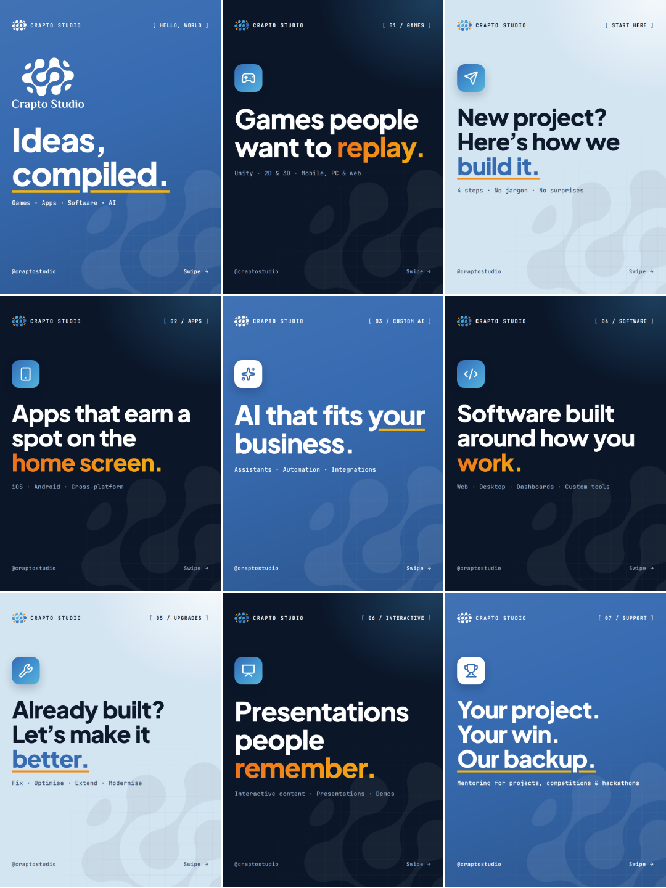
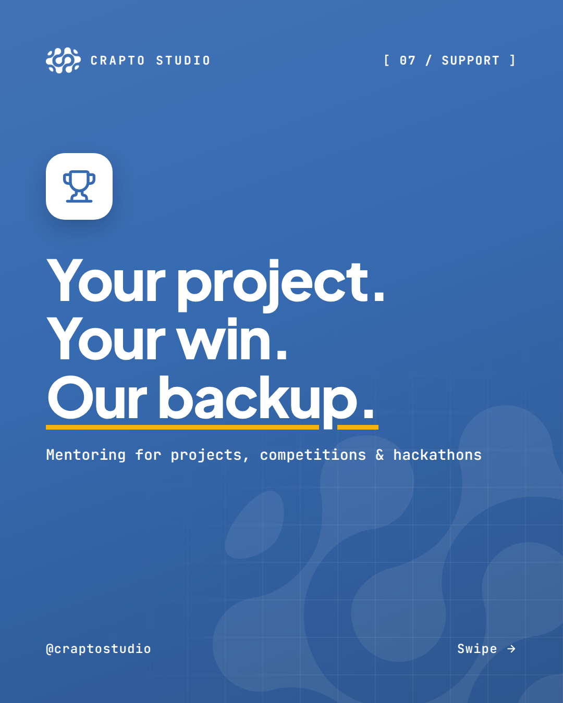
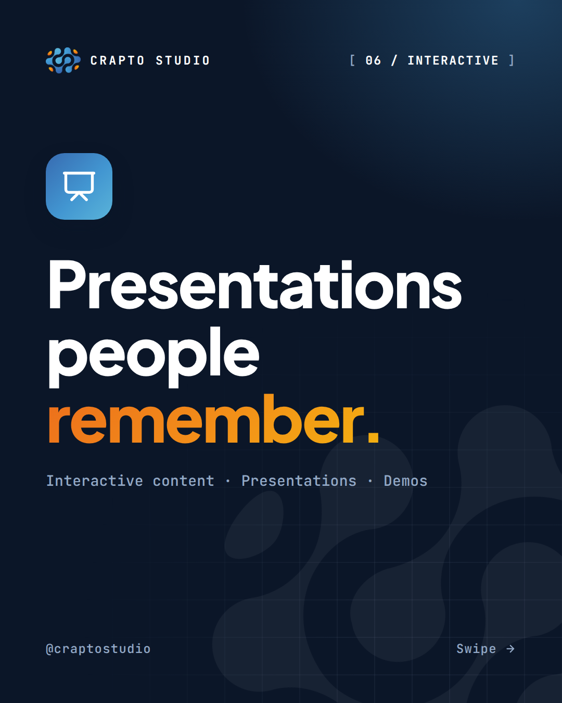
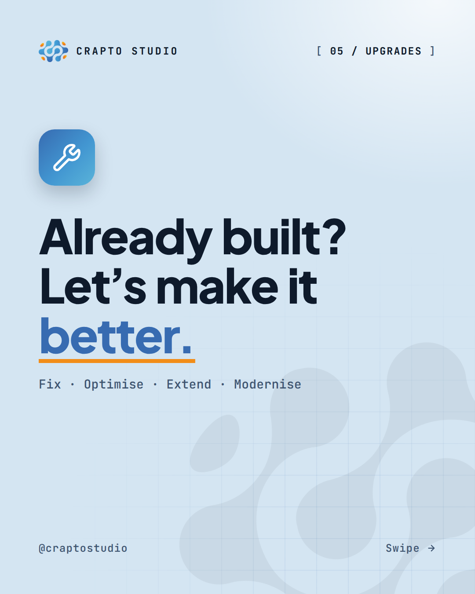
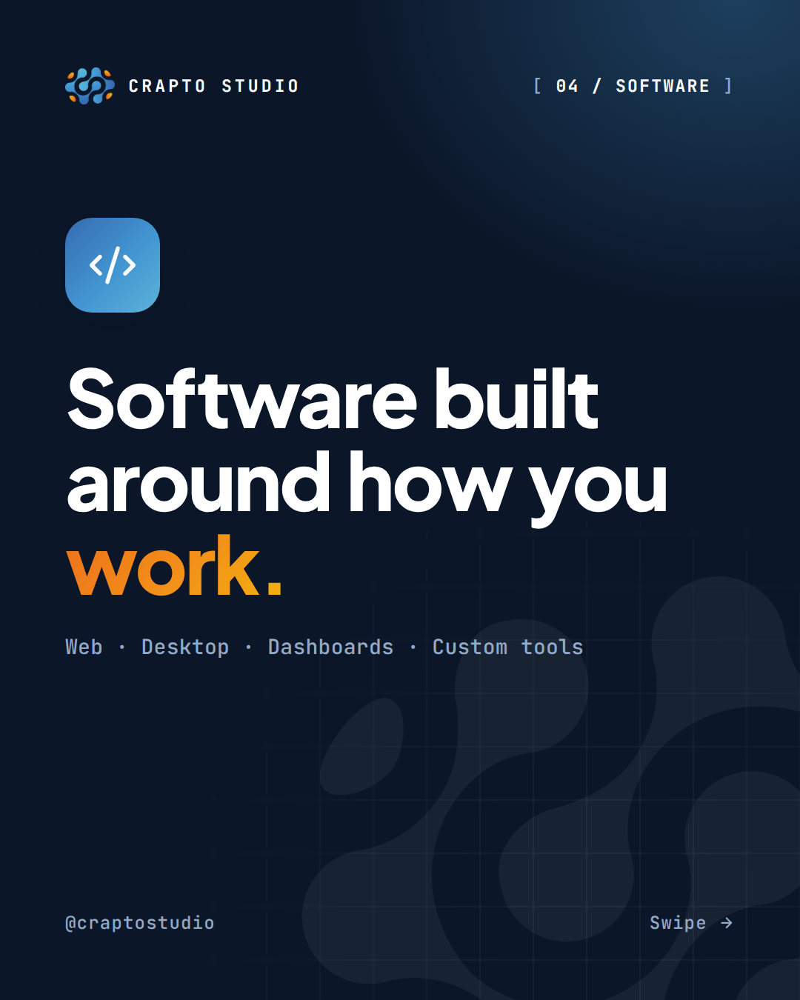
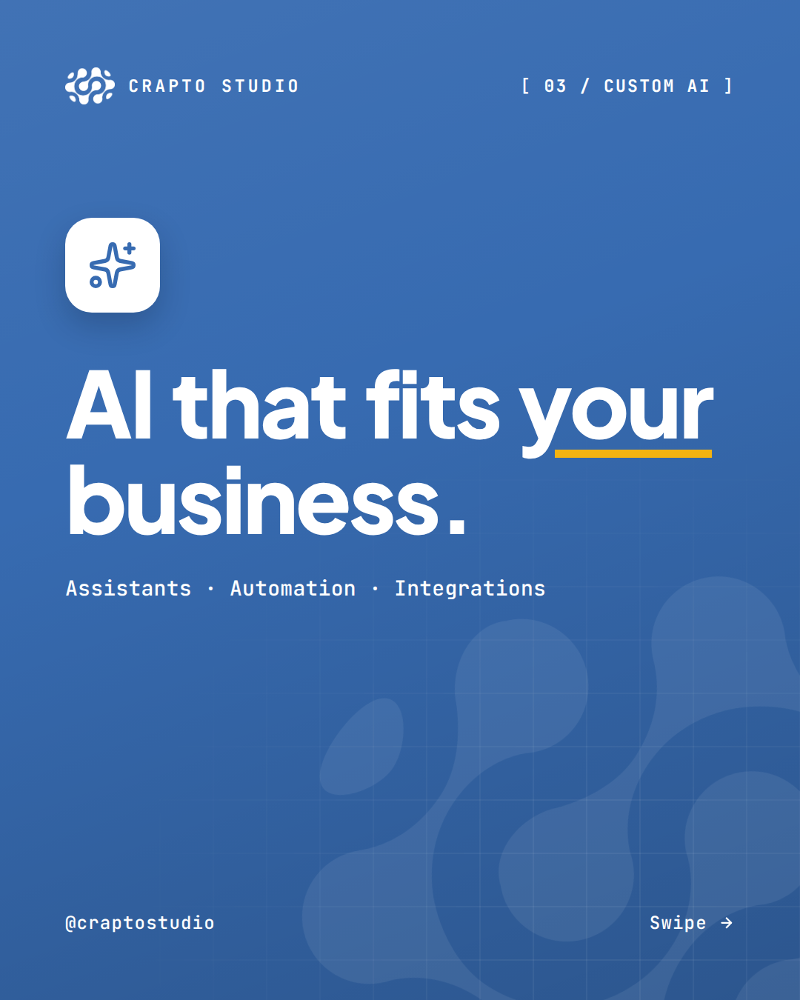
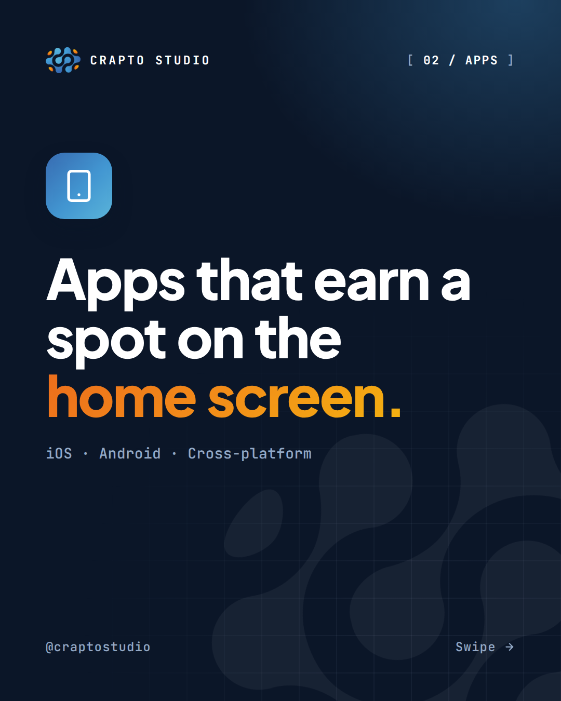
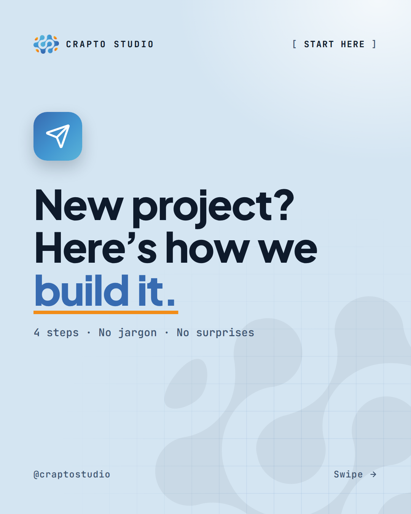
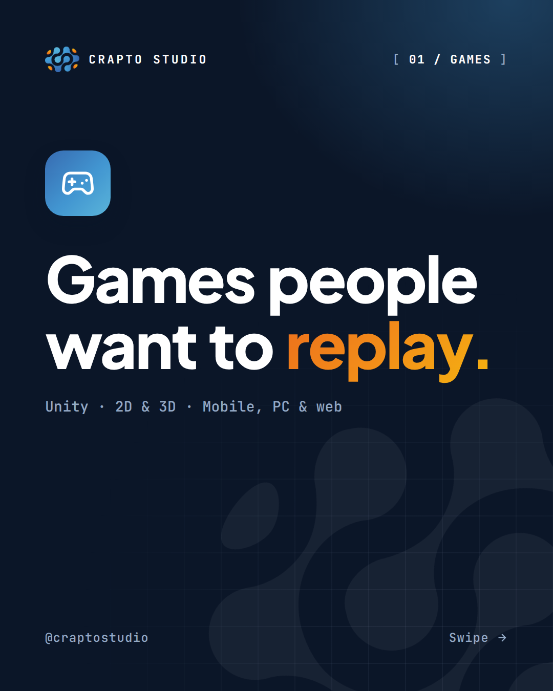
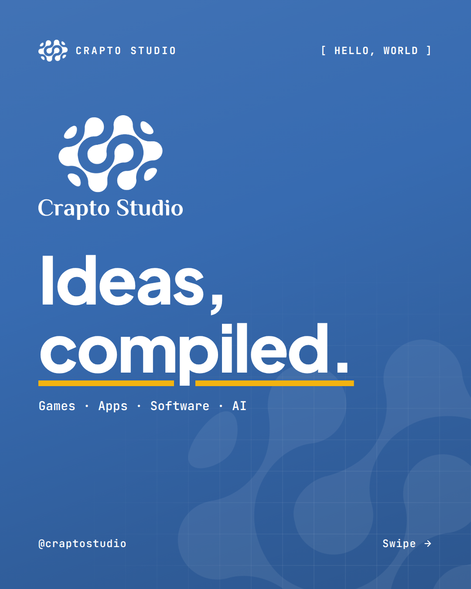

# Launch posts: Crapto Studio

The 9 launch posts, ready to publish: which files to upload, in which order, and the caption, hashtags and alt text for each one.

Do the [profile setup](01-profile-setup.md) first. Then publish these 9 posts. Then follow the [content strategy](02-content-strategy.md).

> **Handle:** this guide assumes the handle **@craptostudio**. If yours is different, swap it in. The handle is printed on every slide (bottom-left, and in the "Follow" button on the last slide): change it in `design/tokens.mjs` and re-render the images (see the [README](../README.md)). The captions don't mention the handle, but you may want the **#craptostudio** hashtag to match it.

**Contents**

1. [How the launch grid works](#1-how-the-launch-grid-works)
2. [The 9 posts, in posting order](#2-the-9-posts-in-posting-order)
3. [After launch](#3-after-launch)

### At a glance

| Post | Name | Theme | Final grid spot | Slides | Folder | Save to highlight |
|---|---|---|---|---|---|---|
| 1 | Support | Blue | Bottom row, right | 3 | `../exports/posts/01-support/` | Support |
| 2 | Interactive | Dark | Bottom row, middle | 3 | `../exports/posts/02-interactive/` | Interactive |
| 3 | Upgrades | Light | Bottom row, left | 3 | `../exports/posts/03-upgrades/` | Upgrades |
| 4 | Software | Dark | Middle row, right | 3 | `../exports/posts/04-software/` | Software |
| 5 | Custom AI | Blue | Centre | 3 | `../exports/posts/05-ai/` | AI |
| 6 | Apps | Dark | Middle row, left | 3 | `../exports/posts/06-apps/` | Apps |
| 7 | Start here | Light | Top row, right | 4 | `../exports/posts/07-start/` | Start |
| 8 | Games | Dark | Top row, middle | 3 | `../exports/posts/08-games/` | Games |
| 9 | Intro | Blue | Top row, left | 5 | `../exports/posts/09-intro/` | Work |

Themes: **Blue** = Cobalt `#376BB1`, shaded slightly darker toward the bottom-right. **Dark** = Midnight `#0B1628`. **Light** = Mist `#D4E5F2`. Only the cover (`01.png`) uses the post's theme. All other slides use the dark theme, so every carousel looks the same after the first swipe.

Logos: every slide uses your own logo files from `../brand/logo/source/` (cropped copies are in `../exports/logo/`). The symbol sits in the top bar of every slide and on the last slide. The Intro cover shows the full white logo (`Crapto Studio-10.png`).

---

## 1) How the launch grid works

### Newest first

Instagram shows the **newest post at the top-left** of your profile grid. Every new post pushes the older ones one square to the right, and then down to the next row.

So the post you publish **first** ends up **bottom-right**, and the post you publish **last** ends up **top-left**. That's why the posting order looks "backwards": Support goes up first, and the Intro post goes up last so it greets visitors at the top of the profile.

### The finished grid

After all 9 posts are live, the grid looks like this:

```
          left                    middle                  right
       +-----------------------+-----------------------+-----------------------+
  top  | Post 9 . Intro        | Post 8 . Games        | Post 7 . Start here   |
       | BLUE                  | dark                  | LIGHT                 |
       +-----------------------+-----------------------+-----------------------+
  mid  | Post 6 . Apps         | Post 5 . Custom AI    | Post 4 . Software     |
       | dark                  | BLUE                  | dark                  |
       +-----------------------+-----------------------+-----------------------+
  bot  | Post 3 . Upgrades     | Post 2 . Interactive  | Post 1 . Support      |
       | LIGHT                 | dark                  | BLUE                  |
       +-----------------------+-----------------------+-----------------------+
```

The themes form an **X** (capitals mark the X):

```
  BLUE   dark   LIGHT
  dark   BLUE   dark
  LIGHT  dark   BLUE
```

- **Blue** runs along the diagonal (top-left → centre → bottom-right).
- **Light** sits in the other two corners.
- **Dark** fills the four edge squares in between.

A small bonus: the number tags on the service covers (`01 / Games`, `02 / Apps` … `07 / Support`) count up when you read the grid row by row, left to right.

**Preview images**

- Grid only: [`../exports/preview/grid.png`](../exports/preview/grid.png)
- Full profile mockup: [`../exports/preview/profile-mockup.png`](../exports/preview/profile-mockup.png)

Both show every post in `design/content.mjs`, newest first. Right now that's the 9 launch posts; once you add later posts and re-render, they show those too and grow taller.



**About the crop:** the posts are 1080×1350 (4:5). The profile grid shows a slightly narrower 3:4 crop of each post. All text and icons sit inside an 88px side margin, so nothing important gets cut off in the grid.

### Publish all 9 before you promote the account

While you post, the grid looks unfinished. Each new post moves all the others by one square, so the X only appears when post 9 is live. Before that, don't share the profile link or run ads. (Following a few accounts in your niche is fine.)

Recommended plan (3 posts a day, so the grid always has full rows):

| Day | Publish | Grid after that day |
|---|---|---|
| Day 1 | Posts 1, 2, 3 | 1 full row |
| Day 2 | Posts 4, 5, 6 | 2 full rows |
| Day 3 | Posts 7, 8, 9 | Finished X: start promoting |

Prefer to do it in one day? That works too. Post them in order and finish all 9 in one session. The day-by-day plan for launch week is in [02-content-strategy.md, section 9](02-content-strategy.md#9-the-first-30-days).

Rules for the launch:

- **Post in order:** 1 → 9. Never skip or swap.
- **Post nothing else to the feed in between.** Reels also appear in the grid by default, so a reel in the middle of the launch moves every square after it. Stories are fine: they don't appear in the grid.
- **Old posts on the account?** That's fine. The 9 newest posts always fill the top 3 rows, and older posts sit below them. But **unpin any old pinned posts first**, or they will sit on top of the launch grid. You can also archive old posts if they don't fit the brand.
- **Scheduling:** professional accounts can usually schedule posts in the app or in Meta Business Suite. If you schedule, leave at least a few minutes between posts so they go out in the right order. Check the grid after each day.

### Pinning reorders the grid

You can pin up to 3 posts. Pinned posts always sit in the top row, so **pinning any post that isn't already in the top row breaks the X**.

- **Pin only after all 9 posts are live.**
- **The one safe choice at launch:** pin the posts that are already in the top row (`09-intro`, `08-games`, `07-start`). Then the grid looks the same. Pin `07-start` first, then `08-games`, then `09-intro` last: the most recently pinned post usually shows first (top-left). Section 10 of [01-profile-setup.md](01-profile-setup.md#10-pinned-posts) explains this and when to swap pins.
- After pinning, check the top row. If the order looks wrong, unpin and pin again in a different order.
- **Pinning anything else** (for example a real project post later) moves it to the top and shifts the rest. Do that once the launch pattern is no longer the priority, or simply accept the new order. Real work matters more than a pattern.

### How to publish one post

Instagram moves and renames menus between app versions. These steps are a guide. If something looks different, look for a similar button.

1. Tap **+** → **Post**.
2. Tap the "select multiple" icon and pick the slides **in order**: `01.png` first, then `02.png`, `03.png` … The number on each thumbnail shows the order.
3. **Check the crop.** The preview should show the full portrait image (4:5), not a square. If it's square, tap the crop/expand icon on the preview.
4. Don't add filters. The colours are already correct.
5. Paste the **caption** from this guide.
6. Add **alt text**: on the last screen, look for **Accessibility** → **Write alt text** (often under **Advanced settings**), and paste the alt text from this guide for the cover.
7. Tap **Share**.
8. Open the new post and share it to your story (paper plane icon → **Add to story**). Don't make the highlight yet: create all the highlights after post 9 is live, in the order from [01-profile-setup.md, section 8](01-profile-setup.md#8-story-highlights). The "Save to highlight" column above shows where each story goes.
9. Open your profile and check the grid.

Before you publish post 1, make sure the **"START" saved reply** is ready and tested ([01-profile-setup.md, section 9](01-profile-setup.md#9-dm-setup)). Every launch post asks people to DM "START".

### Notes that apply to all 9 posts

| Topic | Recommendation |
|---|---|
| Captions | Paste the whole code block. Line breaks usually stay when you paste. If the app removes the empty lines, the caption still reads fine. Every caption is under 1,000 characters (Instagram allows 2,200). |
| Your own words | The captions describe the way of working from the [brand guide](../brand/brand-guide.md): clear quote, weekly progress, honest advice. If a line doesn't match how you actually work, change it before you post. |
| Hook | In the feed, Instagram shows only the start of a caption before "more", so each first line works on its own. All hooks are under 125 characters (counted with a script, shown above each caption). |
| Hashtags | Instagram limits posts to 5 hashtags. Each caption has 5, always including **#craptostudio**. The service posts use the set for that service from [02-content-strategy.md](02-content-strategy.md#hashtags-max-5-per-post), the Intro uses the "Studio / general" set, and the Start post has its own set for people planning a project. Use the same sets for later posts. Never add crypto tags (see the [brand guide](../brand/brand-guide.md#how-not-to-be-mistaken-for-a-crypto-account)). |
| First comment | Not needed. The hashtags fit in the caption. |
| Music | Optional. Carousels can have a music track. If you add one, pick a quiet instrumental track. Business accounts may only see a smaller, royalty-free library. That's fine. |
| Location | Optional. Add your real city (`[your city]`) only if you want local clients to find you. |
| Collab | Only invite a collaborator if a real partner worked on the post and agrees. None of the launch posts need one. |
| Alt text | Each cover's alt text below is 100 characters or fewer, so it fits even if your app limits the length. For the other slides it's optional, but good for accessibility: write a short summary of the slide (for example: "How we help: project mentoring, debugging, code reviews, hackathon prep."). The "Slides" table of each post has the text. |
| After posting | You can edit the caption and alt text later. Changing the images usually means deleting and re-posting, and a re-posted post lands top-left, which breaks the order. So check the slides before you tap Share. |
| Comments | Reply to real comments. Delete crypto spam (the [brand guide](../brand/brand-guide.md#how-not-to-be-mistaken-for-a-crypto-account) has a ready reply for "Is this a crypto thing?"). |

---

## 2) The 9 posts, in posting order

Every post ends with the same **CTA slide** (the last file in each folder): the colour symbol, the headline "Got an idea? Let's compile it.", the line: DM us "START" or tap the link in bio, and we'll reply with next steps. Below that are three buttons: "Follow @craptostudio", "Save" and "Share".

---

### Post 1 — Support



| | |
|---|---|
| Final grid spot | Bottom row, right |
| Theme | Blue |
| Upload | `../exports/posts/01-support/` → `01.png`, `02.png`, `03.png` (3 slides) |
| Highlight | Support |

**Slides**

| File | Slide | What it shows |
|---|---|---|
| `01.png` | Cover | Tag "07 / Support", trophy icon, headline "Your project. Your win. *Our backup.*", line "Programming projects · Competitions · Hackathons". |
| `02.png` | List: "How we help" | Mentoring for programming projects; debugging & code review sessions; competition & hackathon preparation; architecture & tech-stack guidance; "We explain the why, so you can present it with confidence". |
| `03.png` | CTA | "Got an idea? Let's compile it." + DM "START" / link in bio. |

**Caption** (hook: 104 characters)

```
Stuck on a programming project, or getting ready for a hackathon? You don't have to figure it out alone.

We mentor students and teams. We don't do the project for you. We help you do it yourself.
We look at your code with you, help you find the bug, and explain the "why" behind each fix.
That way you understand every part, and you can explain it to your teacher or the judges.
Please check your school's or competition's rules on outside help first. We work within them.

DM us "START" with your project, your deadline and where you're stuck.

#craptostudio #hackathon #programming #learntocode #computerscience
```

**Alt text** (cover)

```
Blue slide, trophy icon: "Your project. Your win. Our backup." Coding mentoring and hackathon prep.
```

**Posting notes**

- This is your first post, so for now it sits alone at the top-left. That's expected.
- Keep the mentoring framing everywhere: guidance, reviews and explanations, never doing someone's assignment. If a student asks you to "just do it", use the mentoring saved reply (`mentor`) from [01-profile-setup.md](01-profile-setup.md#9-dm-setup).
- No location or collab needed. Later, if you mentor at a real hackathon, you can invite the organiser as a collaborator on that post (only if they agree).

---

### Post 2 — Interactive



| | |
|---|---|
| Final grid spot | Bottom row, middle |
| Theme | Dark |
| Upload | `../exports/posts/02-interactive/` → `01.png`, `02.png`, `03.png` (3 slides) |
| Highlight | Interactive |

**Slides**

| File | Slide | What it shows |
|---|---|---|
| `01.png` | Cover | Tag "06 / Interactive", presentation icon, headline "Presentations people *remember*.", line "Interactive content · Presentations · Experiences". |
| `02.png` | List: "What we build" | Interactive presentations & pitch decks; touchscreen & kiosk experiences for events; interactive lessons, quizzes & training; 3D product showcases & demos; gamified campaigns for brands. |
| `03.png` | CTA | "Got an idea? Let's compile it." + DM "START" / link in bio. |

**Caption** (hook: 75 characters)

```
Slides get skimmed. Things people can tap, play and explore get remembered.

We build interactive content for brands, marketers, teachers and event teams.
Picture a pitch deck you click through like an app, a product you can turn in 3D, or a quiz on a touchscreen at your event stand.
Our game-development side helps here: the same skills that make games fun make content people want to touch.

Planning an event, a launch or a course? DM us "START" with the date and your idea.

#craptostudio #interactivecontent #presentationdesign #eventtech #gamification
```

**Alt text** (cover)

```
Dark slide, presentation icon: "Presentations people remember." Interactive content and experiences.
```

**Posting notes**

- No location needed. When you later post a real event build, add that event's location to that post.
- Nice to have later: a short clip of an interactive piece in use, saved to the Interactive highlight.

---

### Post 3 — Upgrades



| | |
|---|---|
| Final grid spot | Bottom row, left |
| Theme | Light |
| Upload | `../exports/posts/03-upgrades/` → `01.png`, `02.png`, `03.png` (3 slides) |
| Highlight | Upgrades |

**Slides**

| File | Slide | What it shows |
|---|---|---|
| `01.png` | Cover | Tag "05 / Upgrades", trending-up arrow icon, headline "Already built? Let's make it *better*.", line "Fix · Optimize · Extend · Modernize". |
| `02.png` | List: "What we do" | Code review & project health check; bug fixing and performance tuning; new features on your existing codebase; UI/UX refresh without starting over; updates to new versions, SDKs & platforms. |
| `03.png` | CTA | "Got an idea? Let's compile it." + DM "START" / link in bio. |

**Caption** (hook: 88 characters)

```
Your app, game or software might not need a rebuild. It might just need the right fixes.

We start with a health check: we run your project, read the code and list what's broken or slow.
Then you get a clear plan: what to fix first, what can wait, and what isn't worth paying for.
If starting over really is the better choice, we'll tell you honestly.
It doesn't matter who wrote the code: you, another studio, or a freelancer who has moved on.

DM us "START" with a link to your project and what's bothering you about it.

#craptostudio #codereview #refactoring #bugfix #appdevelopment
```

**Alt text** (cover)

```
Light blue slide, arrow icon: "Already built? Let's make it better." Upgrades for existing software.
```

**Posting notes**

- **Check point:** the top row is now full. From left to right it should read light (Upgrades), dark (Interactive), blue (Support).
- Later, a real before/after (a fixed bug, a faster screen) is the best follow-up to this post. Only show real numbers.

---

### Post 4 — Software



| | |
|---|---|
| Final grid spot | Middle row, right |
| Theme | Dark |
| Upload | `../exports/posts/04-software/` → `01.png`, `02.png`, `03.png` (3 slides) |
| Highlight | Software |

**Slides**

| File | Slide | What it shows |
|---|---|---|
| `01.png` | Cover | Tag "04 / Software", code icon, headline "Software built around how you *work*.", line "Web · Desktop · Dashboards · Custom tools". |
| `02.png` | List: "What we build" | Custom business software & internal tools; web platforms, portals & dashboards; spreadsheets & paperwork → real systems; APIs and integrations between your tools; documented code that you fully own. |
| `03.png` | CTA | "Got an idea? Let's compile it." + DM "START" / link in bio. |

**Caption** (hook: 101 characters)

```
Still running your business on spreadsheets, copy-paste and long email threads? There's a better way.

Ready-made software often makes you change how you work. Custom software is built around it.
We start by looking at how your team works today: the steps, the files, the tasks you repeat every week.
Then we build in small steps, so you can try each part and give feedback while it's being built.

DM us "START" and tell us which task takes up the most time in your week.

#craptostudio #softwaredevelopment #webdevelopment #webapp #businesssoftware
```

**Alt text** (cover)

```
Dark slide, code icon: "Software built around how you work." Web, desktop, dashboards, custom tools.
```

**Posting notes**

- No location or collab needed.
- When you show real software later, blur names, emails and any private data.

---

### Post 5 — Custom AI



| | |
|---|---|
| Final grid spot | Centre |
| Theme | Blue |
| Upload | `../exports/posts/05-ai/` → `01.png`, `02.png`, `03.png` (3 slides) |
| Highlight | AI |

**Slides**

| File | Slide | What it shows |
|---|---|---|
| `01.png` | Cover | Tag "03 / Custom AI", sparkles icon, headline "AI that fits *your* business.", line "Assistants · Automation · Integrations". |
| `02.png` | List: "What we build" | AI assistants that know your business data; automations for docs, emails & reports; AI features inside your app or website; vision, voice & data-analysis tools; "Honest advice, including when you don't need AI". |
| `03.png` | CTA | "Got an idea? Let's compile it." + DM "START" / link in bio. |

**Caption** (hook: 91 characters)

```
AI is only useful when it solves a real problem in your business. So that's where we start.

First we ask: what takes too long, what gets repeated, what gets missed?
Then we choose the simplest fix. Sometimes that's AI. Sometimes it's a basic automation with no AI at all.
We can start with a small test on your own examples, so you see results before you commit to more.
And we'll explain in plain words where your data goes and who can see it.

Got a task you wish would run by itself? DM us "START" and describe it in one sentence.

#craptostudio #artificialintelligence #aiautomation #aiforbusiness #chatbot
```

**Alt text** (cover)

```
Blue slide, sparkles icon: "AI that fits your business." Custom AI assistants and automation.
```

**Posting notes**

- This post ends up in the centre of the X once all 9 are live. Until then it moves one square with each new post. That's expected.
- Don't add promises like "save 10 hours a week" unless you have measured it on a real project.

---

### Post 6 — Apps



| | |
|---|---|
| Final grid spot | Middle row, left |
| Theme | Dark |
| Upload | `../exports/posts/06-apps/` → `01.png`, `02.png`, `03.png` (3 slides) |
| Highlight | Apps |

**Slides**

| File | Slide | What it shows |
|---|---|---|
| `01.png` | Cover | Tag "02 / Apps", smartphone icon, headline "Apps that earn a spot on the *home screen*.", line "iOS · Android · Cross-platform". |
| `02.png` | List: "What we build" | iOS & Android apps, native or cross-platform; UI/UX design that feels obvious to use; accounts, payments, maps & notifications; backends, admin panels & APIs; store publishing, updates & maintenance. |
| `03.png` | CTA | "Got an idea? Let's compile it." + DM "START" / link in bio. |

**Caption** (hook: 90 characters)

```
An app is only worth building if people open it again tomorrow. That's what we design for.

Not sure if you need a native app, a cross-platform app or just a good website? We'll help you choose, and we'll say so if a website is enough.
"Native" means built separately for iOS and for Android. "Cross-platform" means one shared set of code for both, which can save time.
We start with the one thing your app must do really well, and build from there.

Got an app idea? DM us "START" and tell us about it in one sentence.

#craptostudio #appdevelopment #iosdev #androiddev #mobileapp
```

**Alt text** (cover)

```
Dark slide, phone icon: "Apps that earn a spot on the home screen." iOS, Android, cross-platform.
```

**Posting notes**

- **Check point:** two full rows are now live. The top row should read dark (Apps), blue (AI), dark (Software), with light (Upgrades), dark (Interactive), blue (Support) below it. Posts 7–9 will push both rows down by one.
- No location or collab needed.

---

### Post 7 — Start here



| | |
|---|---|
| Final grid spot | Top row, right |
| Theme | Light |
| Upload | `../exports/posts/07-start/` → `01.png`, `02.png`, `03.png`, `04.png` (4 slides) |
| Highlight | Start |

**Slides**

| File | Slide | What it shows |
|---|---|---|
| `01.png` | Cover | Tag "Start here", paper plane icon, headline "Got an idea? Here's how we *build it*.", line "4 steps · no jargon · no surprises". |
| `02.png` | Steps: "How we work" | 1 Talk (tell us the idea, goal and timeline; DM "START" or link in bio), 2 Plan (scope, right tech, clear quote and timeline), 3 Build (real progress every week), 4 Launch & support (ship, hand over, stay for updates). |
| `03.png` | List: "Send us this first" | What you want to build (one sentence is fine); who it's for; your deadline; your budget range; links or apps you like. |
| `04.png` | CTA | "Got an idea? Let's compile it." + DM "START" / link in bio. |

**Caption** (hook: 88 characters)

```
Not sure how to start a project with a tech studio? Here's the whole process in 4 steps.

You don't need a technical plan to start. A rough idea is enough. Asking the right questions is our job.
Don't know your budget yet? A rough range is fine. It helps us suggest the right size for a first version.
Not sure what to build? Tell us the problem instead, and we'll help you shape the idea.

Save this post for the checklist, then DM us "START" or use the link in bio when you're ready.

#craptostudio #startup #smallbusiness #productdevelopment #appdevelopment
```

**Alt text** (cover)

```
Light blue slide, paper plane icon: "Got an idea? Here's how we build it." 4 steps to start.
```

**Posting notes**

- This is the most useful post for new visitors. When you share it to your story, add a **link sticker** to `[your project brief form link]` before saving it to the Start highlight.
- The "Send us this first" slide matches the "START" saved reply word for word, so people get the same list in DMs.
- This post stays in the top row at launch and is a good long-term pin (see [Pinning](#pinning-reorders-the-grid)).

---

### Post 8 — Games



| | |
|---|---|
| Final grid spot | Top row, middle |
| Theme | Dark |
| Upload | `../exports/posts/08-games/` → `01.png`, `02.png`, `03.png` (3 slides) |
| Highlight | Games |

**Slides**

| File | Slide | What it shows |
|---|---|---|
| `01.png` | Cover | Tag "01 / Games", game controller icon, headline "Games people want to *replay*.", line "Unity · 2D & 3D · Mobile, PC & Web". |
| `02.png` | List: "What we build" | Full games in Unity, from concept to release; playable prototypes & vertical slices; advergames & gamified experiences for brands; gameplay systems, UI and game feel; builds for mobile, PC and WebGL. |
| `03.png` | CTA | "Got an idea? Let's compile it." + DM "START" / link in bio. |

**Caption** (hook: 96 characters)

```
A game idea is easy to explain. Making it fun to play is the hard part. That's the part we love.

Not sure your idea works yet? Start with a playable prototype: a small version of the core game that real players can test before you build the full thing.
We care about "game feel": how a jump, a hit or a button press feels in your hands. It's the difference between a game people try once and one they replay.
Brands: a short branded game (an "advergame") gives people a reason to spend time with your product, by choice.

Got a game idea? DM us "START" and tell us about it in one sentence. 🎮

#craptostudio #gamedev #unity3d #madewithunity #indiedev
```

**Alt text** (cover)

```
Dark slide, game controller icon: "Games people want to replay." Unity games for mobile, PC and web.
```

**Posting notes**

- Music is a nice fit here if you want it: a light, game-style instrumental track. Still optional.
- Games are the most visual service. Plan a short gameplay clip or work-in-progress reel soon after launch (see [04-idea-bank.md](04-idea-bank.md)), but post it **after** post 9, not in between.

---

### Post 9 — Intro



| | |
|---|---|
| Final grid spot | Top row, left (the first post visitors see) |
| Theme | Blue |
| Upload | `../exports/posts/09-intro/` → `01.png`, `02.png`, `03.png`, `04.png`, `05.png` (5 slides) |
| Highlight | Work |

**Slides**

| File | Slide | What it shows |
|---|---|---|
| `01.png` | Cover | Tag "Hello, world", the full white Crapto Studio logo, headline "Ideas, *compiled.*", line "Games · Apps · Software · AI". |
| `02.png` | Statement: "// who we are" | "Crapto Studio is a tech studio. We *design and build* games, apps, software and custom AI, and we level up projects that already exist." |
| `03.png` | Services: "What we build" | 8 cards: Games (Unity · 2D & 3D), Apps (iOS & Android), Software (web, desktop, tools), Custom AI (assistants & automation), Interactive (content & presentations), Upgrades (fix, optimize, extend), Support (projects & competitions), Custom (whatever you need built). |
| `04.png` | Steps: "Why work with us" | Honest scoping (clear quote and timeline; we'll say if you don't need it); Weekly progress (working builds you can try); You own it (clean, documented code and every asset); We stick around (updates, fixes and new features after launch). |
| `05.png` | CTA | "Got an idea? Let's compile it." + DM "START" / link in bio. |

**Caption** (hook: 110 characters)

```
Hello, world 👋 We're Crapto Studio, a tech studio that designs and builds games, apps, software and custom AI.

You bring the idea. We turn it into something that runs. That's what "Ideas, compiled." means.

What we do:
• Games in Unity (2D & 3D, for mobile, PC and web)
• iOS & Android apps
• Software: web platforms, dashboards and custom tools
• Custom AI: assistants, automation and AI features
• Interactive content and presentations
• Upgrades for apps, games and software that already exist
• Mentoring and guidance for programming projects and competitions
• Custom solutions for whatever else you need built

We work with startups, small businesses, brands, educators, event teams, game creators, students and competition teams.
Follow along for our builds, behind-the-scenes and practical tips.

Got an idea? DM us "START" or tap the link in bio.

#craptostudio #gamedev #appdevelopment #softwaredevelopment #artificialintelligence
```

**Alt text** (cover)

```
White Crapto Studio logo on blue, headline "Ideas, compiled." Games, apps, software and custom AI.
```

**Posting notes**

- **Final check:** open your profile and compare the grid with [`../exports/preview/grid.png`](../exports/preview/grid.png). You should see the X: blue on the diagonal, light in the two other corners.
- Now you can pin (see [Pinning](#pinning-reorders-the-grid)) and create the highlights in reverse order ([01-profile-setup.md, section 8](01-profile-setup.md#8-story-highlights)).
- Then start promoting the account: share this post to your story, send the profile to your network, and add the Instagram link to your website and other profiles.
- This is the best post to send to people who already know you. Ask them to share it with anyone who needs a game, app, software or AI built.

---

## 3) After launch

The launch posts explain **what** Crapto Studio does. The next posts should **show** it.

| When | What to do | Where to look |
|---|---|---|
| Rest of week 1, then week 2 onwards | Tell your own network, post your first Reel, then start the regular posting rhythm. Mix the content pillars and formats. | [02-content-strategy.md](02-content-strategy.md#9-the-first-30-days) (pillars, weekly rhythm, first 30 days) |
| Any time you need an idea | Pick a post, reel or story idea and adapt it. | [04-idea-bank.md](04-idea-bank.md) (post ideas, reel scripts, hook formulas) |
| First real project you can show | Post it (case study, demo or before/after, with the client's permission) and swap it into your pins. | [01-profile-setup.md, section 10](01-profile-setup.md#10-pinned-posts) |
| First real review | Add it to the Reviews highlight (or create the highlight now, if you skipped it at launch). Never write or invent one. Until then use `[add a real client quote]` as a placeholder only in drafts. | [01-profile-setup.md, section 8](01-profile-setup.md#8-story-highlights) |
| After 2 weeks | Open **Insights** and compare the 9 launch posts: saves, shares and profile visits. Also check which posts led to DMs (count those yourself). Make more of what worked. | [02-content-strategy.md, section 8](02-content-strategy.md#8-measuring-what-works) |

Good to know:

- The X pattern moves by one square with every new post (pinned posts stay where they are). That's normal. Don't hold back new content to protect it.
- You can re-share any launch post to your story later, for example when someone asks "What do you do?"
- To change the text on a launch slide, edit `design/content.mjs`, re-render and run `npm run check` to confirm all text is still readable (see the [README](../README.md)). You generally can't replace the images in a published post, so only do this before you post, or for future posts.
