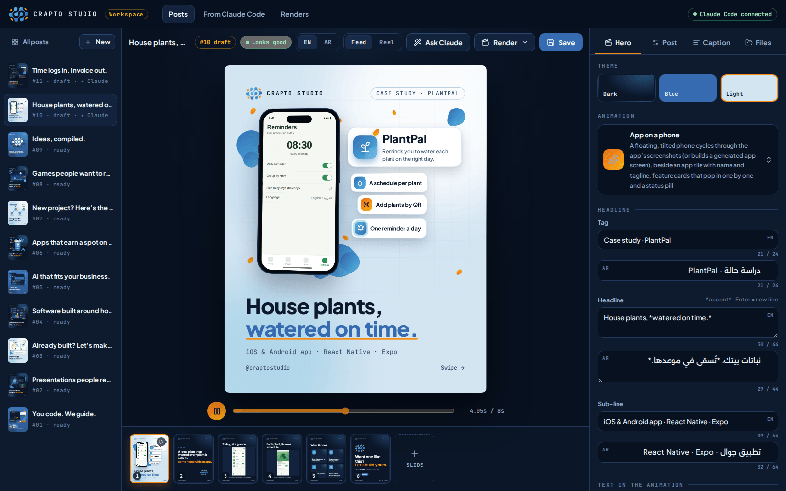
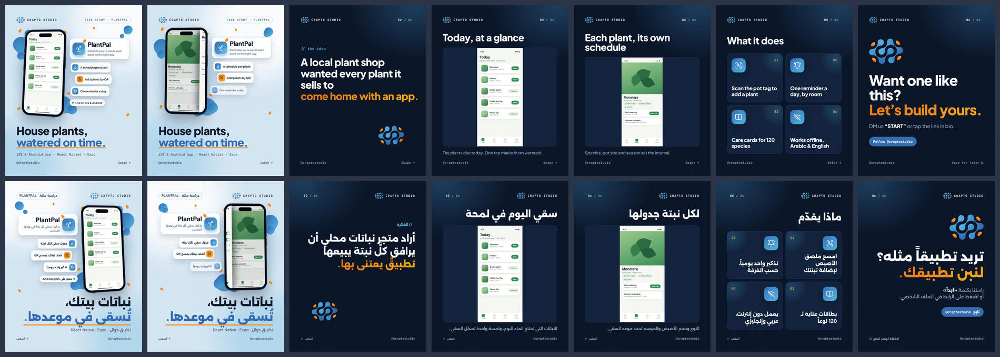
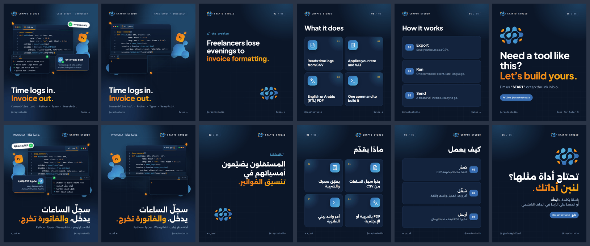
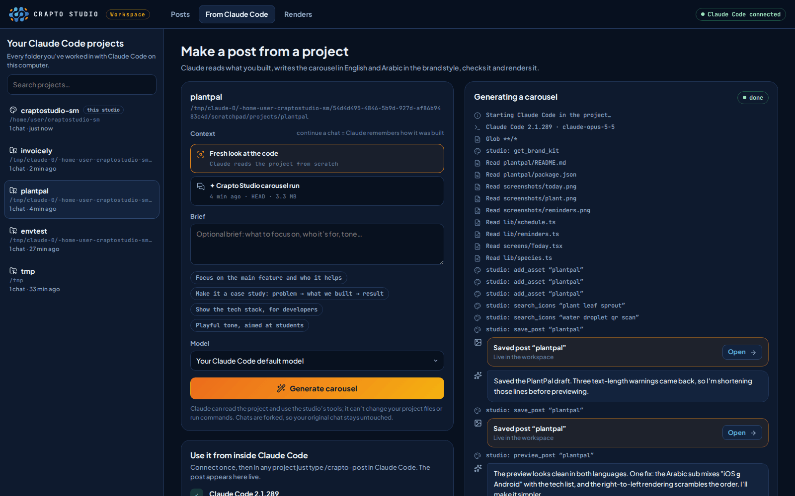

# Crapto Studio workspace

A web workspace on your computer to edit every post, preview the animations live, make new posts, and render images and videos. It is connected to Claude Code: Claude can turn any project you built with it into a finished carousel in the brand's style, in English and Arabic.

```bash
npm install
npm run studio          # → http://localhost:4600   (add -- --open to open the browser)
npm run connect         # once: lets you type /crapto-post inside Claude Code
```

It runs on your computer (not on a website) because rendering uses Chromium and ffmpeg. It only listens on `localhost`.



## What you can do

| Screen | What it does |
|---|---|
| **Posts** | Your grid, newest first, in English or Arabic. Click a post to edit it, or press **New post**. Posts made by Claude carry a ✦ Claude badge. |
| **Editor** | The animated hero plays live (scrub the timeline, pause with Space). Switch **EN / AR** and **Feed / Reel**. The filmstrip shows every slide: click to edit, drag to reorder, **+ Slide** to add one. |
| **From Claude Code** | Every project you've worked on with Claude Code. Pick one (and optionally one of its chats), add a brief, press **Generate carousel** and watch Claude work. Then ask for changes in the same conversation. |
| **Renders** | The render queue: images, videos and contrast checks, from the workspace or from Claude Code. |

### The editor's inspector

- **Hero**: theme (dark, blue, light), the animation, tag, headline (`*accent*`, Enter for a new line) and sub-line, then the **text in the animation** and its **settings** (screenshots, icon, code, tech stack…). Every text field has an English and an Arabic box with a length guide.
- **Slide**: the fields of the selected slide (icon cards, steps, statement, services, screenshot, call to action). Change its type, move, duplicate or delete it.
- **Post**: slug (renames the files), posting order (the `NN-` folder), status (draft, ready, published), icon, and where the post came from.
- **Caption**: the English and Arabic captions and alt text, with hook length and hashtag counts, and copy buttons.
- **Files**: render buttons, progress, the rendered videos and images, and the post's uploaded screenshots (drop files here).

The **checks** pill in the toolbar shows errors (which block saving) and warnings (text too long, an icon that reads as crypto, missing captions). Save with the button or **Ctrl/Cmd + S**. If Claude Code changes the post you have open, it reloads (or asks, if you have unsaved edits).

### Animations for any project

Besides the nine service animations, four **project showcase** animations take their content from the post:

| Scene | Use it for | Fill in |
|---|---|---|
| `showcase-phone` | Mobile apps | up to 3 portrait screenshots, app name, tagline, feature chips |
| `showcase-browser` | Websites, web apps, dashboards | up to 3 screenshots, URL, a callout, chips |
| `showcase-code` | Libraries, APIs, backends, bots, AI pipelines | a short code snippet, the command, its output, the result |
| `showcase-stack` | Anything (games, systems, hardware) | logo or icon, name, tech stack, feature cards |

Without screenshots, the phone and browser scenes draw a clean placeholder UI in the brand colours. The rules for writing new scenes are in [`design/scenes/README.md`](../design/scenes/README.md).

## Claude Code, two ways

### 1. Inside Claude Code: `/crapto-post`

Run `npm run connect` once (or press **Connect now** on the From Claude Code screen). It:

1. registers the `crapto-studio` MCP server with Claude Code for all your projects (`claude mcp add --scope user …`), and
2. installs the `/crapto-post` skill in `~/.claude/skills/crapto-post/`.

Then, in any project, in the chat where you built it:

```
/crapto-post
/crapto-post focus on the offline mode, for parents
```

or just ask "make a Crapto Studio carousel about this project". Claude reads the brand kit, looks at the project (and at what you built together in that chat), picks an animation, copies real screenshots into the studio, writes both languages, saves the post, **looks at a preview image of it** and fixes what's off, checks contrast and renders the stills. The post appears in the workspace while it works. Restart Claude Code after connecting.

`npm run connect -- --print` shows what it would change; `npm run connect -- --remove` undoes it.

### 2. From the workspace: Generate carousel

On **From Claude Code**, pick a project. Choose **Fresh look at the code**, or one of the project's chats: Claude then continues a copy (a fork) of that chat, so it knows how the project was built and what you decided, and your original chat stays untouched. Add an optional brief and press **Generate carousel**.

The workspace runs your own `claude` command in that folder (your login, your settings), with the studio's tools. Claude may read the project but not change its files or run commands in it. When it's done, ask for changes in the box below the log, or copy the `claude --resume …` command to continue in your terminal.

### What it makes

Two carousels Claude made in testing, from two small **sample projects** written for the test (a plant-care app and an invoicing command-line tool; they are not real client work). Each row is one language: the cover, a moment of the animation, then the slides.

From the workspace (**Generate carousel**, a fresh look at a React Native app with three screenshots in its repo): Claude picked `showcase-phone`, used the real screenshots in the phone and on two slides, and wrote both languages.



From inside Claude Code (`/crapto-post` in a Python command-line project with no screenshots): Claude picked `showcase-code` with a real snippet from the project.



While it works, the **From Claude Code** screen shows every step:



A full generation took about 3 minutes; the cost depends on the model and the project's size (in testing, about $0.35 with Sonnet for a small project, about $1.25 with Opus). It runs on your own Claude Code plan or API key, like any Claude Code session.

### The tools Claude gets (MCP server `crapto-studio`)

| Tool | What it does |
|---|---|
| `get_brand_kit`, `get_playbook` | The voice and rules in both languages, the scenes and their fields, the slide types, the post schema, the existing posts; the step-by-step playbook |
| `list_posts`, `get_post`, `list_scenes`, `search_icons`, `suggest_slug` | Look things up |
| `add_asset` | Copy a screenshot or logo from the project into `content/assets/<post>/` |
| `save_post` | Validate and save a post (returns the problems to fix) |
| `preview_post` | A picture of the cover, a mid-animation frame and every slide, in both languages, plus layout warnings |
| `check_post` | Text contrast on every cover and slide |
| `render_post`, `get_render_status` | Render the stills (and optionally queue the videos) |

## Where things live

```
content/posts/<slug>.json      one file per post (text in en + ar, scene, slides, captions)
content/assets/<slug>/         screenshots and images used by that post
exports/posts/NN-<slug>/       rendered covers, slides and hero videos (en/ and ar/)
exports/reels/                 rendered Reels
studio/                        the workspace (server.mjs, public/), the MCP server (mcp.mjs),
                               the shared core (core/) and the Claude playbook (claude/)
.studio/                       render jobs, Claude run logs and the trash (not in git)
```

Deleted posts go to `.studio/trash/` with their rendered files.

## Settings

| Variable | Default | |
|---|---|---|
| `STUDIO_PORT` | `4600` | The workspace port (set it for `npm run connect` too, so Claude's links match) |
| `CLAUDE_BIN` | `claude` | Path to the Claude Code CLI, if it isn't on your PATH |
| `CLAUDE_CONFIG_DIR` | `~/.claude` | Where Claude Code keeps its projects and skills |
